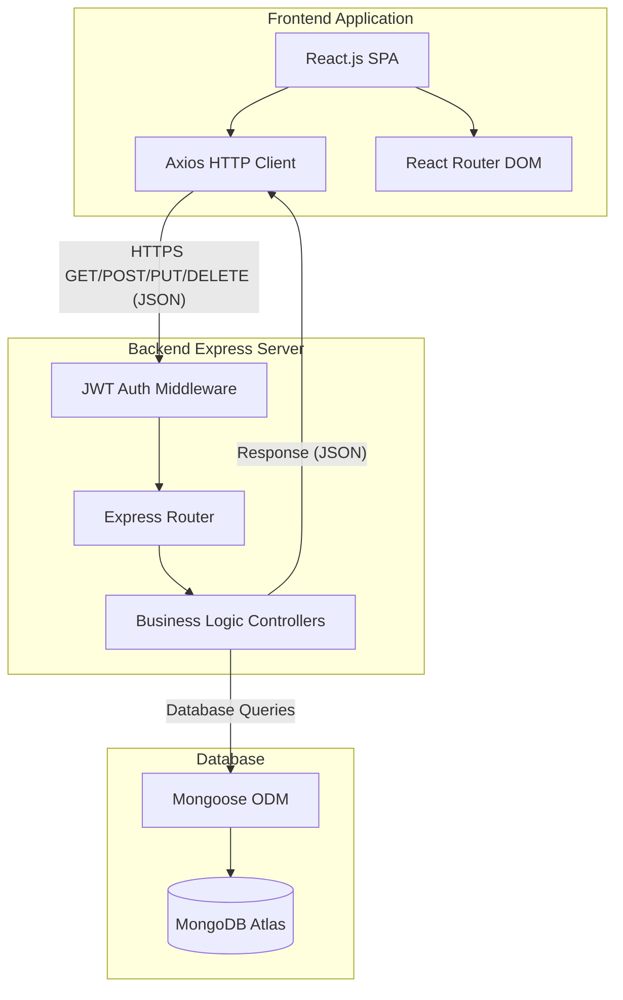
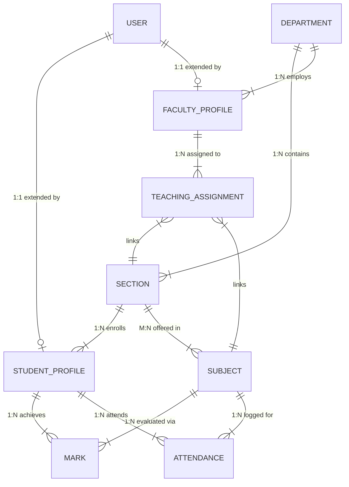
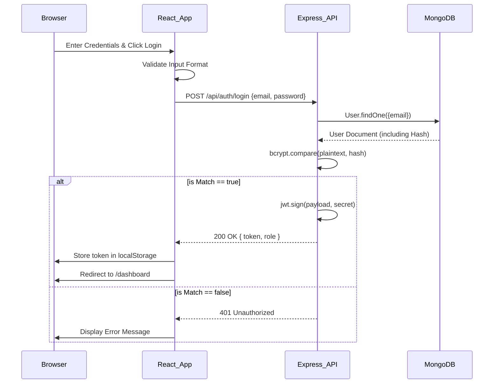

<div align="center">

**STUDENT RESULT MANAGEMENT SYSTEM WITH ROLE-BASED ACCESS CONTROL AND AI INTEGRATION (SRMS-RBAC-AI)**

<br><br>
**A PROJECT REPORT**
<br><br>

Submitted by
<br><br>

**[NAME OF THE CANDIDATE 1]**<br>
**[NAME OF THE CANDIDATE 2]**
<br><br>

in partial fulfillment for the award of the degree
<br>
of
<br><br>

**BACHELOR OF ENGINEERING**
<br><br>

IN
<br><br>

**COMPUTER SCIENCE AND ENGINEERING**
<br><br>

**[NAME OF THE COLLEGE]**
<br><br>

**ANNA UNIVERSITY : CHENNAI 600 025**
<br><br>

**[MONTH & YEAR]**

</div>

<div style="page-break-after: always;"></div>

<div align="center">

**ANNA UNIVERSITY : CHENNAI 600 025**

**BONAFIDE CERTIFICATE**

</div>
<br><br>

Certified that this project report **"STUDENT RESULT MANAGEMENT SYSTEM WITH ROLE-BASED ACCESS CONTROL AND AI INTEGRATION (SRMS-RBAC-AI)"** is the bonafide work of **"[NAME OF THE CANDIDATE 1], [NAME OF THE CANDIDATE 2]"** who carried out the project work under my supervision.

<br><br><br><br>

**SIGNATURE** &nbsp;&nbsp;&nbsp;&nbsp;&nbsp;&nbsp;&nbsp;&nbsp;&nbsp;&nbsp;&nbsp;&nbsp;&nbsp;&nbsp;&nbsp;&nbsp;&nbsp;&nbsp;&nbsp;&nbsp;&nbsp;&nbsp;&nbsp;&nbsp;&nbsp;&nbsp;&nbsp;&nbsp;&nbsp;&nbsp;&nbsp;&nbsp;&nbsp;&nbsp;&nbsp;&nbsp;&nbsp;&nbsp;&nbsp;&nbsp;&nbsp;&nbsp;&nbsp;&nbsp;&nbsp;&nbsp;&nbsp;&nbsp;&nbsp;&nbsp;&nbsp;&nbsp;&nbsp;&nbsp;&nbsp;&nbsp;&nbsp;&nbsp;&nbsp;&nbsp; **SIGNATURE**
<br>
**[NAME OF HOD]** &nbsp;&nbsp;&nbsp;&nbsp;&nbsp;&nbsp;&nbsp;&nbsp;&nbsp;&nbsp;&nbsp;&nbsp;&nbsp;&nbsp;&nbsp;&nbsp;&nbsp;&nbsp;&nbsp;&nbsp;&nbsp;&nbsp;&nbsp;&nbsp;&nbsp;&nbsp;&nbsp;&nbsp;&nbsp;&nbsp;&nbsp;&nbsp;&nbsp;&nbsp;&nbsp;&nbsp;&nbsp;&nbsp;&nbsp;&nbsp;&nbsp;&nbsp;&nbsp;&nbsp;&nbsp;&nbsp;&nbsp;&nbsp;&nbsp;&nbsp;&nbsp;&nbsp; **[NAME OF SUPERVISOR]**
<br>
**HEAD OF THE DEPARTMENT** &nbsp;&nbsp;&nbsp;&nbsp;&nbsp;&nbsp;&nbsp;&nbsp;&nbsp;&nbsp;&nbsp;&nbsp;&nbsp;&nbsp;&nbsp;&nbsp;&nbsp;&nbsp;&nbsp;&nbsp;&nbsp;&nbsp;&nbsp;&nbsp;&nbsp;&nbsp;&nbsp;&nbsp;&nbsp;&nbsp; **SUPERVISOR**
<br>
[Academic Designation] &nbsp;&nbsp;&nbsp;&nbsp;&nbsp;&nbsp;&nbsp;&nbsp;&nbsp;&nbsp;&nbsp;&nbsp;&nbsp;&nbsp;&nbsp;&nbsp;&nbsp;&nbsp;&nbsp;&nbsp;&nbsp;&nbsp;&nbsp;&nbsp;&nbsp;&nbsp;&nbsp;&nbsp;&nbsp;&nbsp;&nbsp;&nbsp;&nbsp;&nbsp;&nbsp;&nbsp;&nbsp;&nbsp;&nbsp;&nbsp;&nbsp;&nbsp;&nbsp; [Academic Designation]
<br>
[Department Name] &nbsp;&nbsp;&nbsp;&nbsp;&nbsp;&nbsp;&nbsp;&nbsp;&nbsp;&nbsp;&nbsp;&nbsp;&nbsp;&nbsp;&nbsp;&nbsp;&nbsp;&nbsp;&nbsp;&nbsp;&nbsp;&nbsp;&nbsp;&nbsp;&nbsp;&nbsp;&nbsp;&nbsp;&nbsp;&nbsp;&nbsp;&nbsp;&nbsp;&nbsp;&nbsp;&nbsp;&nbsp;&nbsp;&nbsp;&nbsp;&nbsp;&nbsp;&nbsp;&nbsp;&nbsp;&nbsp;&nbsp;&nbsp; [Department Name]
<br>
[Full Address of College] &nbsp;&nbsp;&nbsp;&nbsp;&nbsp;&nbsp;&nbsp;&nbsp;&nbsp;&nbsp;&nbsp;&nbsp;&nbsp;&nbsp;&nbsp;&nbsp;&nbsp;&nbsp;&nbsp;&nbsp;&nbsp;&nbsp;&nbsp;&nbsp;&nbsp;&nbsp;&nbsp;&nbsp;&nbsp;&nbsp;&nbsp;&nbsp;&nbsp;&nbsp;&nbsp;&nbsp;&nbsp;&nbsp;&nbsp;&nbsp;&nbsp;&nbsp; [Full Address of College]

<div style="page-break-after: always;"></div>

<div align="center">
**ABSTRACT**
</div>
<br>

The Student Result Management System with Role-Based Access Control and AI Integration (SRMS-RBAC-AI) is a highly scalable, comprehensive web-based platform engineered to automate and secure the academic administrative lifecycle. Traditional educational management relies heavily on fragmented, paper-based workflows or localized databases, leading to severe data synchronization issues, lack of real-time auditing, and compromised data security. This project resolves these critical bottlenecks by introducing a centralized, API-driven architecture built entirely on the modern MERN (MongoDB, Express.js, React.js, Node.js) stack.

The core of the system is governed by a strict Role-Based Access Control (RBAC) matrix that mathematically isolates user operations based on four designated tiers: Administrator, Head of Department (HOD), Faculty, and Student. This ensures that data mutations—such as entering attendance records or evaluating examination marks—are securely confined to authorized personnel while maintaining a transparent read-only view for end-users. The backend infrastructure utilizes Node.js and Express.js to construct high-performance RESTful APIs, securing all endpoints through JSON Web Token (JWT) session validation and bcrypt cryptographic hashing for credentials.

Data persistence is managed via MongoDB, capitalizing on its schema flexibility to represent complex, hierarchical academic relationships (e.g., Department, Section, Subject, Teaching Assignment) without the performance penalties of deep SQL joins. The frontend, constructed with React.js and compiled via Vite, delivers a highly responsive Single Page Application (SPA) experience. It integrates advanced client-side processing, utilizing libraries such as Recharts for generating real-time analytical dashboards and jsPDF/XLSX for exporting official academic reports directly from the browser, thereby significantly reducing server compute loads. Furthermore, the modular architecture lays the groundwork for advanced security implementations, such as WebAuthn for FIDO2-compliant biometric authentication, ensuring the application remains future-proof. SRMS-RBAC-AI ultimately provides a resilient, highly optimized, and mathematically secure ecosystem for institutional data governance.

<div style="page-break-after: always;"></div>

<div align="center">
**TABLE OF CONTENTS**
</div>
<br>

**CHAPTER NO.** &nbsp;&nbsp;&nbsp;&nbsp;&nbsp;&nbsp;&nbsp;&nbsp;&nbsp;&nbsp;&nbsp;&nbsp;&nbsp;&nbsp;&nbsp;&nbsp;&nbsp;&nbsp;&nbsp;&nbsp;&nbsp;&nbsp;&nbsp; **TITLE** &nbsp;&nbsp;&nbsp;&nbsp;&nbsp;&nbsp;&nbsp;&nbsp;&nbsp;&nbsp;&nbsp;&nbsp;&nbsp;&nbsp;&nbsp;&nbsp;&nbsp;&nbsp;&nbsp;&nbsp;&nbsp;&nbsp;&nbsp;&nbsp;&nbsp;&nbsp;&nbsp;&nbsp;&nbsp;&nbsp;&nbsp;&nbsp;&nbsp;&nbsp;&nbsp;&nbsp;&nbsp;&nbsp;&nbsp;&nbsp;&nbsp;&nbsp;&nbsp;&nbsp;&nbsp;&nbsp;&nbsp;&nbsp;&nbsp;&nbsp;&nbsp;&nbsp;&nbsp; **PAGE NO.**
&nbsp;&nbsp;&nbsp;&nbsp;&nbsp;&nbsp;&nbsp;&nbsp;&nbsp;&nbsp;&nbsp;&nbsp;&nbsp;&nbsp;&nbsp;&nbsp;&nbsp;&nbsp;&nbsp;&nbsp;&nbsp;&nbsp;&nbsp;&nbsp;&nbsp;&nbsp;&nbsp;&nbsp;&nbsp;&nbsp;&nbsp;&nbsp;&nbsp;&nbsp;&nbsp;&nbsp;&nbsp;&nbsp;&nbsp;&nbsp;&nbsp;&nbsp;&nbsp;&nbsp;&nbsp;&nbsp;&nbsp;&nbsp;&nbsp; ABSTRACT &nbsp;&nbsp;&nbsp;&nbsp;&nbsp;&nbsp;&nbsp;&nbsp;&nbsp;&nbsp;&nbsp;&nbsp;&nbsp;&nbsp;&nbsp;&nbsp;&nbsp;&nbsp;&nbsp;&nbsp;&nbsp;&nbsp;&nbsp;&nbsp;&nbsp;&nbsp;&nbsp;&nbsp;&nbsp;&nbsp;&nbsp;&nbsp;&nbsp;&nbsp;&nbsp;&nbsp;&nbsp;&nbsp;&nbsp;&nbsp;&nbsp;&nbsp;&nbsp;&nbsp;&nbsp;&nbsp;&nbsp;&nbsp;&nbsp;&nbsp;&nbsp;&nbsp;&nbsp;&nbsp; iii
&nbsp;&nbsp;&nbsp;&nbsp;&nbsp;&nbsp;&nbsp;&nbsp;&nbsp;&nbsp;&nbsp;&nbsp;&nbsp;&nbsp;&nbsp;&nbsp;&nbsp;&nbsp;&nbsp;&nbsp;&nbsp;&nbsp;&nbsp;&nbsp;&nbsp;&nbsp;&nbsp;&nbsp;&nbsp;&nbsp;&nbsp;&nbsp;&nbsp;&nbsp;&nbsp;&nbsp;&nbsp;&nbsp;&nbsp;&nbsp;&nbsp;&nbsp;&nbsp;&nbsp;&nbsp;&nbsp;&nbsp;&nbsp;&nbsp; LIST OF FIGURES &nbsp;&nbsp;&nbsp;&nbsp;&nbsp;&nbsp;&nbsp;&nbsp;&nbsp;&nbsp;&nbsp;&nbsp;&nbsp;&nbsp;&nbsp;&nbsp;&nbsp;&nbsp;&nbsp;&nbsp;&nbsp;&nbsp;&nbsp;&nbsp;&nbsp;&nbsp;&nbsp;&nbsp;&nbsp;&nbsp;&nbsp;&nbsp;&nbsp;&nbsp;&nbsp;&nbsp;&nbsp;&nbsp;&nbsp;&nbsp;&nbsp;&nbsp;&nbsp; vi

**1.** &nbsp;&nbsp;&nbsp;&nbsp;&nbsp;&nbsp;&nbsp;&nbsp;&nbsp;&nbsp;&nbsp;&nbsp;&nbsp;&nbsp;&nbsp;&nbsp;&nbsp;&nbsp;&nbsp;&nbsp;&nbsp;&nbsp;&nbsp;&nbsp;&nbsp;&nbsp;&nbsp;&nbsp;&nbsp;&nbsp;&nbsp;&nbsp;&nbsp;&nbsp;&nbsp;&nbsp;&nbsp;&nbsp;&nbsp;&nbsp;&nbsp;&nbsp;&nbsp; **INTRODUCTION** &nbsp;&nbsp;&nbsp;&nbsp;&nbsp;&nbsp;&nbsp;&nbsp;&nbsp;&nbsp;&nbsp;&nbsp;&nbsp;&nbsp;&nbsp;&nbsp;&nbsp;&nbsp;&nbsp;&nbsp;&nbsp;&nbsp;&nbsp;&nbsp;&nbsp;&nbsp;&nbsp;&nbsp;&nbsp;&nbsp;&nbsp;&nbsp;&nbsp;&nbsp;&nbsp;&nbsp;&nbsp;&nbsp;&nbsp;&nbsp; **1**
&nbsp;&nbsp;&nbsp;&nbsp;&nbsp;&nbsp;&nbsp;&nbsp;&nbsp; 1.1 &nbsp;&nbsp;&nbsp;&nbsp;&nbsp;&nbsp;&nbsp;&nbsp;&nbsp;&nbsp;&nbsp;&nbsp;&nbsp;&nbsp;&nbsp;&nbsp;&nbsp;&nbsp;&nbsp;&nbsp;&nbsp;&nbsp;&nbsp;&nbsp;&nbsp;&nbsp;&nbsp;&nbsp;&nbsp;&nbsp;&nbsp;&nbsp;&nbsp; GENERAL OVERVIEW &nbsp;&nbsp;&nbsp;&nbsp;&nbsp;&nbsp;&nbsp;&nbsp;&nbsp;&nbsp;&nbsp;&nbsp;&nbsp;&nbsp;&nbsp;&nbsp;&nbsp;&nbsp;&nbsp;&nbsp;&nbsp;&nbsp;&nbsp;&nbsp;&nbsp;&nbsp;&nbsp;&nbsp;&nbsp;&nbsp;&nbsp;&nbsp; 1
&nbsp;&nbsp;&nbsp;&nbsp;&nbsp;&nbsp;&nbsp;&nbsp;&nbsp; 1.2 &nbsp;&nbsp;&nbsp;&nbsp;&nbsp;&nbsp;&nbsp;&nbsp;&nbsp;&nbsp;&nbsp;&nbsp;&nbsp;&nbsp;&nbsp;&nbsp;&nbsp;&nbsp;&nbsp;&nbsp;&nbsp;&nbsp;&nbsp;&nbsp;&nbsp;&nbsp;&nbsp;&nbsp;&nbsp;&nbsp;&nbsp;&nbsp;&nbsp; ENGINEERING DECISIONS &nbsp;&nbsp;&nbsp;&nbsp;&nbsp;&nbsp;&nbsp;&nbsp;&nbsp;&nbsp;&nbsp;&nbsp;&nbsp;&nbsp;&nbsp;&nbsp;&nbsp;&nbsp;&nbsp;&nbsp;&nbsp;&nbsp;&nbsp; 3
&nbsp;&nbsp;&nbsp;&nbsp;&nbsp;&nbsp;&nbsp;&nbsp;&nbsp;&nbsp;&nbsp;&nbsp;&nbsp;&nbsp;&nbsp;&nbsp;&nbsp; 1.2.1 &nbsp;&nbsp;&nbsp;&nbsp;&nbsp;&nbsp;&nbsp;&nbsp;&nbsp;&nbsp;&nbsp;&nbsp;&nbsp;&nbsp;&nbsp;&nbsp;&nbsp;&nbsp;&nbsp;&nbsp;&nbsp; Technology Stack Selection &nbsp;&nbsp;&nbsp;&nbsp;&nbsp;&nbsp;&nbsp;&nbsp;&nbsp;&nbsp;&nbsp;&nbsp;&nbsp;&nbsp;&nbsp;&nbsp;&nbsp;&nbsp;&nbsp;&nbsp;&nbsp;&nbsp;&nbsp;&nbsp;&nbsp; 4
&nbsp;&nbsp;&nbsp;&nbsp;&nbsp;&nbsp;&nbsp;&nbsp;&nbsp;&nbsp;&nbsp;&nbsp;&nbsp;&nbsp;&nbsp;&nbsp;&nbsp; 1.2.2 &nbsp;&nbsp;&nbsp;&nbsp;&nbsp;&nbsp;&nbsp;&nbsp;&nbsp;&nbsp;&nbsp;&nbsp;&nbsp;&nbsp;&nbsp;&nbsp;&nbsp;&nbsp;&nbsp;&nbsp;&nbsp; Monolithic Architecture vs Microservices &nbsp;&nbsp;&nbsp;&nbsp;&nbsp; 5
&nbsp;&nbsp;&nbsp;&nbsp;&nbsp;&nbsp;&nbsp;&nbsp;&nbsp;&nbsp;&nbsp;&nbsp;&nbsp;&nbsp;&nbsp;&nbsp;&nbsp; 1.2.3 &nbsp;&nbsp;&nbsp;&nbsp;&nbsp;&nbsp;&nbsp;&nbsp;&nbsp;&nbsp;&nbsp;&nbsp;&nbsp;&nbsp;&nbsp;&nbsp;&nbsp;&nbsp;&nbsp;&nbsp;&nbsp; Scalability and Performance Trade-offs &nbsp;&nbsp;&nbsp;&nbsp;&nbsp;&nbsp;&nbsp; 7

**2.** &nbsp;&nbsp;&nbsp;&nbsp;&nbsp;&nbsp;&nbsp;&nbsp;&nbsp;&nbsp;&nbsp;&nbsp;&nbsp;&nbsp;&nbsp;&nbsp;&nbsp;&nbsp;&nbsp;&nbsp;&nbsp;&nbsp;&nbsp;&nbsp;&nbsp;&nbsp;&nbsp;&nbsp;&nbsp;&nbsp;&nbsp;&nbsp;&nbsp;&nbsp;&nbsp;&nbsp;&nbsp;&nbsp;&nbsp;&nbsp;&nbsp;&nbsp;&nbsp; **SYSTEM ARCHITECTURE** &nbsp;&nbsp;&nbsp;&nbsp;&nbsp;&nbsp;&nbsp;&nbsp;&nbsp;&nbsp;&nbsp;&nbsp;&nbsp;&nbsp;&nbsp;&nbsp;&nbsp;&nbsp;&nbsp;&nbsp;&nbsp;&nbsp;&nbsp;&nbsp; **9**
&nbsp;&nbsp;&nbsp;&nbsp;&nbsp;&nbsp;&nbsp;&nbsp;&nbsp; 2.1 &nbsp;&nbsp;&nbsp;&nbsp;&nbsp;&nbsp;&nbsp;&nbsp;&nbsp;&nbsp;&nbsp;&nbsp;&nbsp;&nbsp;&nbsp;&nbsp;&nbsp;&nbsp;&nbsp;&nbsp;&nbsp;&nbsp;&nbsp;&nbsp;&nbsp;&nbsp;&nbsp;&nbsp;&nbsp;&nbsp;&nbsp;&nbsp;&nbsp; CLIENT-SERVER COMMUNICATION &nbsp;&nbsp;&nbsp;&nbsp;&nbsp;&nbsp;&nbsp; 9
&nbsp;&nbsp;&nbsp;&nbsp;&nbsp;&nbsp;&nbsp;&nbsp;&nbsp; 2.2 &nbsp;&nbsp;&nbsp;&nbsp;&nbsp;&nbsp;&nbsp;&nbsp;&nbsp;&nbsp;&nbsp;&nbsp;&nbsp;&nbsp;&nbsp;&nbsp;&nbsp;&nbsp;&nbsp;&nbsp;&nbsp;&nbsp;&nbsp;&nbsp;&nbsp;&nbsp;&nbsp;&nbsp;&nbsp;&nbsp;&nbsp;&nbsp;&nbsp; DATA FLOW ARCHITECTURE &nbsp;&nbsp;&nbsp;&nbsp;&nbsp;&nbsp;&nbsp;&nbsp;&nbsp;&nbsp;&nbsp;&nbsp;&nbsp;&nbsp;&nbsp;&nbsp;&nbsp;&nbsp;&nbsp;&nbsp; 12
&nbsp;&nbsp;&nbsp;&nbsp;&nbsp;&nbsp;&nbsp;&nbsp;&nbsp; 2.3 &nbsp;&nbsp;&nbsp;&nbsp;&nbsp;&nbsp;&nbsp;&nbsp;&nbsp;&nbsp;&nbsp;&nbsp;&nbsp;&nbsp;&nbsp;&nbsp;&nbsp;&nbsp;&nbsp;&nbsp;&nbsp;&nbsp;&nbsp;&nbsp;&nbsp;&nbsp;&nbsp;&nbsp;&nbsp;&nbsp;&nbsp;&nbsp;&nbsp; DATABASE SCHEMA DESIGN &nbsp;&nbsp;&nbsp;&nbsp;&nbsp;&nbsp;&nbsp;&nbsp;&nbsp;&nbsp;&nbsp;&nbsp;&nbsp;&nbsp;&nbsp;&nbsp;&nbsp;&nbsp; 15
&nbsp;&nbsp;&nbsp;&nbsp;&nbsp;&nbsp;&nbsp;&nbsp;&nbsp; 2.4 &nbsp;&nbsp;&nbsp;&nbsp;&nbsp;&nbsp;&nbsp;&nbsp;&nbsp;&nbsp;&nbsp;&nbsp;&nbsp;&nbsp;&nbsp;&nbsp;&nbsp;&nbsp;&nbsp;&nbsp;&nbsp;&nbsp;&nbsp;&nbsp;&nbsp;&nbsp;&nbsp;&nbsp;&nbsp;&nbsp;&nbsp;&nbsp;&nbsp; ROLE-BASED ACCESS CONTROL (RBAC) 19

**3.** &nbsp;&nbsp;&nbsp;&nbsp;&nbsp;&nbsp;&nbsp;&nbsp;&nbsp;&nbsp;&nbsp;&nbsp;&nbsp;&nbsp;&nbsp;&nbsp;&nbsp;&nbsp;&nbsp;&nbsp;&nbsp;&nbsp;&nbsp;&nbsp;&nbsp;&nbsp;&nbsp;&nbsp;&nbsp;&nbsp;&nbsp;&nbsp;&nbsp;&nbsp;&nbsp;&nbsp;&nbsp;&nbsp;&nbsp;&nbsp;&nbsp;&nbsp;&nbsp; **IMPLEMENTATION & MODULES** &nbsp;&nbsp;&nbsp;&nbsp;&nbsp;&nbsp;&nbsp;&nbsp;&nbsp;&nbsp;&nbsp;&nbsp; **22**
&nbsp;&nbsp;&nbsp;&nbsp;&nbsp;&nbsp;&nbsp;&nbsp;&nbsp; 3.1 &nbsp;&nbsp;&nbsp;&nbsp;&nbsp;&nbsp;&nbsp;&nbsp;&nbsp;&nbsp;&nbsp;&nbsp;&nbsp;&nbsp;&nbsp;&nbsp;&nbsp;&nbsp;&nbsp;&nbsp;&nbsp;&nbsp;&nbsp;&nbsp;&nbsp;&nbsp;&nbsp;&nbsp;&nbsp;&nbsp;&nbsp;&nbsp;&nbsp; AUTHENTICATION MODULE &nbsp;&nbsp;&nbsp;&nbsp;&nbsp;&nbsp;&nbsp;&nbsp;&nbsp;&nbsp;&nbsp;&nbsp;&nbsp;&nbsp;&nbsp;&nbsp;&nbsp;&nbsp; 22
&nbsp;&nbsp;&nbsp;&nbsp;&nbsp;&nbsp;&nbsp;&nbsp;&nbsp; 3.2 &nbsp;&nbsp;&nbsp;&nbsp;&nbsp;&nbsp;&nbsp;&nbsp;&nbsp;&nbsp;&nbsp;&nbsp;&nbsp;&nbsp;&nbsp;&nbsp;&nbsp;&nbsp;&nbsp;&nbsp;&nbsp;&nbsp;&nbsp;&nbsp;&nbsp;&nbsp;&nbsp;&nbsp;&nbsp;&nbsp;&nbsp;&nbsp;&nbsp; ACADEMIC SETUP MODULE &nbsp;&nbsp;&nbsp;&nbsp;&nbsp;&nbsp;&nbsp;&nbsp;&nbsp;&nbsp;&nbsp;&nbsp;&nbsp;&nbsp;&nbsp;&nbsp;&nbsp;&nbsp;&nbsp; 25
&nbsp;&nbsp;&nbsp;&nbsp;&nbsp;&nbsp;&nbsp;&nbsp;&nbsp; 3.3 &nbsp;&nbsp;&nbsp;&nbsp;&nbsp;&nbsp;&nbsp;&nbsp;&nbsp;&nbsp;&nbsp;&nbsp;&nbsp;&nbsp;&nbsp;&nbsp;&nbsp;&nbsp;&nbsp;&nbsp;&nbsp;&nbsp;&nbsp;&nbsp;&nbsp;&nbsp;&nbsp;&nbsp;&nbsp;&nbsp;&nbsp;&nbsp;&nbsp; ATTENDANCE MANAGEMENT MODULE &nbsp;&nbsp; 28
&nbsp;&nbsp;&nbsp;&nbsp;&nbsp;&nbsp;&nbsp;&nbsp;&nbsp; 3.4 &nbsp;&nbsp;&nbsp;&nbsp;&nbsp;&nbsp;&nbsp;&nbsp;&nbsp;&nbsp;&nbsp;&nbsp;&nbsp;&nbsp;&nbsp;&nbsp;&nbsp;&nbsp;&nbsp;&nbsp;&nbsp;&nbsp;&nbsp;&nbsp;&nbsp;&nbsp;&nbsp;&nbsp;&nbsp;&nbsp;&nbsp;&nbsp;&nbsp; MARKS & RESULTS MODULE &nbsp;&nbsp;&nbsp;&nbsp;&nbsp;&nbsp;&nbsp;&nbsp;&nbsp;&nbsp;&nbsp;&nbsp;&nbsp;&nbsp;&nbsp;&nbsp;&nbsp;&nbsp; 32
&nbsp;&nbsp;&nbsp;&nbsp;&nbsp;&nbsp;&nbsp;&nbsp;&nbsp; 3.5 &nbsp;&nbsp;&nbsp;&nbsp;&nbsp;&nbsp;&nbsp;&nbsp;&nbsp;&nbsp;&nbsp;&nbsp;&nbsp;&nbsp;&nbsp;&nbsp;&nbsp;&nbsp;&nbsp;&nbsp;&nbsp;&nbsp;&nbsp;&nbsp;&nbsp;&nbsp;&nbsp;&nbsp;&nbsp;&nbsp;&nbsp;&nbsp;&nbsp; TIMETABLE MODULE &nbsp;&nbsp;&nbsp;&nbsp;&nbsp;&nbsp;&nbsp;&nbsp;&nbsp;&nbsp;&nbsp;&nbsp;&nbsp;&nbsp;&nbsp;&nbsp;&nbsp;&nbsp;&nbsp;&nbsp;&nbsp;&nbsp;&nbsp;&nbsp;&nbsp;&nbsp;&nbsp;&nbsp;&nbsp; 36

**4.** &nbsp;&nbsp;&nbsp;&nbsp;&nbsp;&nbsp;&nbsp;&nbsp;&nbsp;&nbsp;&nbsp;&nbsp;&nbsp;&nbsp;&nbsp;&nbsp;&nbsp;&nbsp;&nbsp;&nbsp;&nbsp;&nbsp;&nbsp;&nbsp;&nbsp;&nbsp;&nbsp;&nbsp;&nbsp;&nbsp;&nbsp;&nbsp;&nbsp;&nbsp;&nbsp;&nbsp;&nbsp;&nbsp;&nbsp;&nbsp;&nbsp;&nbsp;&nbsp; **UI/UX & FRONTEND ARCHITECTURE** &nbsp;&nbsp;&nbsp; **39**
&nbsp;&nbsp;&nbsp;&nbsp;&nbsp;&nbsp;&nbsp;&nbsp;&nbsp; 4.1 &nbsp;&nbsp;&nbsp;&nbsp;&nbsp;&nbsp;&nbsp;&nbsp;&nbsp;&nbsp;&nbsp;&nbsp;&nbsp;&nbsp;&nbsp;&nbsp;&nbsp;&nbsp;&nbsp;&nbsp;&nbsp;&nbsp;&nbsp;&nbsp;&nbsp;&nbsp;&nbsp;&nbsp;&nbsp;&nbsp;&nbsp;&nbsp;&nbsp; ROLE-SPECIFIC DASHBOARDS &nbsp;&nbsp;&nbsp;&nbsp;&nbsp;&nbsp;&nbsp;&nbsp;&nbsp;&nbsp;&nbsp;&nbsp;&nbsp;&nbsp; 39
&nbsp;&nbsp;&nbsp;&nbsp;&nbsp;&nbsp;&nbsp;&nbsp;&nbsp; 4.2 &nbsp;&nbsp;&nbsp;&nbsp;&nbsp;&nbsp;&nbsp;&nbsp;&nbsp;&nbsp;&nbsp;&nbsp;&nbsp;&nbsp;&nbsp;&nbsp;&nbsp;&nbsp;&nbsp;&nbsp;&nbsp;&nbsp;&nbsp;&nbsp;&nbsp;&nbsp;&nbsp;&nbsp;&nbsp;&nbsp;&nbsp;&nbsp;&nbsp; STATE MANAGEMENT & API CACHING &nbsp;&nbsp;&nbsp; 42

**5.** &nbsp;&nbsp;&nbsp;&nbsp;&nbsp;&nbsp;&nbsp;&nbsp;&nbsp;&nbsp;&nbsp;&nbsp;&nbsp;&nbsp;&nbsp;&nbsp;&nbsp;&nbsp;&nbsp;&nbsp;&nbsp;&nbsp;&nbsp;&nbsp;&nbsp;&nbsp;&nbsp;&nbsp;&nbsp;&nbsp;&nbsp;&nbsp;&nbsp;&nbsp;&nbsp;&nbsp;&nbsp;&nbsp;&nbsp;&nbsp;&nbsp;&nbsp;&nbsp; **SOFTWARE TESTING STRATEGY** &nbsp;&nbsp;&nbsp;&nbsp;&nbsp;&nbsp;&nbsp;&nbsp;&nbsp;&nbsp; **44**
&nbsp;&nbsp;&nbsp;&nbsp;&nbsp;&nbsp;&nbsp;&nbsp;&nbsp; 5.1 &nbsp;&nbsp;&nbsp;&nbsp;&nbsp;&nbsp;&nbsp;&nbsp;&nbsp;&nbsp;&nbsp;&nbsp;&nbsp;&nbsp;&nbsp;&nbsp;&nbsp;&nbsp;&nbsp;&nbsp;&nbsp;&nbsp;&nbsp;&nbsp;&nbsp;&nbsp;&nbsp;&nbsp;&nbsp;&nbsp;&nbsp;&nbsp;&nbsp; API ENDPOINT VALIDATION &nbsp;&nbsp;&nbsp;&nbsp;&nbsp;&nbsp;&nbsp;&nbsp;&nbsp;&nbsp;&nbsp;&nbsp;&nbsp;&nbsp;&nbsp;&nbsp;&nbsp;&nbsp; 44
&nbsp;&nbsp;&nbsp;&nbsp;&nbsp;&nbsp;&nbsp;&nbsp;&nbsp; 5.2 &nbsp;&nbsp;&nbsp;&nbsp;&nbsp;&nbsp;&nbsp;&nbsp;&nbsp;&nbsp;&nbsp;&nbsp;&nbsp;&nbsp;&nbsp;&nbsp;&nbsp;&nbsp;&nbsp;&nbsp;&nbsp;&nbsp;&nbsp;&nbsp;&nbsp;&nbsp;&nbsp;&nbsp;&nbsp;&nbsp;&nbsp;&nbsp;&nbsp; REALISTIC TEST CASE SCENARIOS &nbsp;&nbsp;&nbsp;&nbsp;&nbsp;&nbsp;&nbsp; 46

**6.** &nbsp;&nbsp;&nbsp;&nbsp;&nbsp;&nbsp;&nbsp;&nbsp;&nbsp;&nbsp;&nbsp;&nbsp;&nbsp;&nbsp;&nbsp;&nbsp;&nbsp;&nbsp;&nbsp;&nbsp;&nbsp;&nbsp;&nbsp;&nbsp;&nbsp;&nbsp;&nbsp;&nbsp;&nbsp;&nbsp;&nbsp;&nbsp;&nbsp;&nbsp;&nbsp;&nbsp;&nbsp;&nbsp;&nbsp;&nbsp;&nbsp;&nbsp;&nbsp; **CONCLUSION** &nbsp;&nbsp;&nbsp;&nbsp;&nbsp;&nbsp;&nbsp;&nbsp;&nbsp;&nbsp;&nbsp;&nbsp;&nbsp;&nbsp;&nbsp;&nbsp;&nbsp;&nbsp;&nbsp;&nbsp;&nbsp;&nbsp;&nbsp;&nbsp;&nbsp;&nbsp;&nbsp;&nbsp;&nbsp;&nbsp;&nbsp;&nbsp;&nbsp;&nbsp;&nbsp;&nbsp;&nbsp;&nbsp;&nbsp;&nbsp;&nbsp;&nbsp; **49**
&nbsp;&nbsp;&nbsp;&nbsp;&nbsp;&nbsp;&nbsp;&nbsp;&nbsp;&nbsp;&nbsp;&nbsp;&nbsp;&nbsp;&nbsp;&nbsp;&nbsp;&nbsp;&nbsp;&nbsp;&nbsp;&nbsp;&nbsp;&nbsp;&nbsp;&nbsp;&nbsp;&nbsp;&nbsp;&nbsp;&nbsp;&nbsp;&nbsp;&nbsp;&nbsp;&nbsp;&nbsp;&nbsp;&nbsp;&nbsp;&nbsp;&nbsp;&nbsp;&nbsp;&nbsp;&nbsp;&nbsp;&nbsp;&nbsp; **APPENDICES** &nbsp;&nbsp;&nbsp;&nbsp;&nbsp;&nbsp;&nbsp;&nbsp;&nbsp;&nbsp;&nbsp;&nbsp;&nbsp;&nbsp;&nbsp;&nbsp;&nbsp;&nbsp;&nbsp;&nbsp;&nbsp;&nbsp;&nbsp;&nbsp;&nbsp;&nbsp;&nbsp;&nbsp;&nbsp;&nbsp;&nbsp;&nbsp;&nbsp;&nbsp;&nbsp;&nbsp;&nbsp;&nbsp;&nbsp;&nbsp;&nbsp;&nbsp; 51
&nbsp;&nbsp;&nbsp;&nbsp;&nbsp;&nbsp;&nbsp;&nbsp;&nbsp;&nbsp;&nbsp;&nbsp;&nbsp;&nbsp;&nbsp;&nbsp;&nbsp;&nbsp;&nbsp;&nbsp;&nbsp;&nbsp;&nbsp;&nbsp;&nbsp;&nbsp;&nbsp;&nbsp;&nbsp;&nbsp;&nbsp;&nbsp;&nbsp;&nbsp;&nbsp;&nbsp;&nbsp;&nbsp;&nbsp;&nbsp;&nbsp;&nbsp;&nbsp;&nbsp;&nbsp;&nbsp;&nbsp;&nbsp;&nbsp; **REFERENCES** &nbsp;&nbsp;&nbsp;&nbsp;&nbsp;&nbsp;&nbsp;&nbsp;&nbsp;&nbsp;&nbsp;&nbsp;&nbsp;&nbsp;&nbsp;&nbsp;&nbsp;&nbsp;&nbsp;&nbsp;&nbsp;&nbsp;&nbsp;&nbsp;&nbsp;&nbsp;&nbsp;&nbsp;&nbsp;&nbsp;&nbsp;&nbsp;&nbsp;&nbsp;&nbsp;&nbsp;&nbsp;&nbsp;&nbsp;&nbsp;&nbsp; 52

<div style="page-break-after: always;"></div>

<div align="center">
**LIST OF FIGURES**
</div>
<br>

**FIGURE NO.** &nbsp;&nbsp;&nbsp;&nbsp;&nbsp;&nbsp;&nbsp;&nbsp;&nbsp;&nbsp;&nbsp;&nbsp;&nbsp;&nbsp;&nbsp;&nbsp;&nbsp;&nbsp;&nbsp;&nbsp;&nbsp;&nbsp;&nbsp;&nbsp;&nbsp;&nbsp;&nbsp;&nbsp;&nbsp; **TITLE** &nbsp;&nbsp;&nbsp;&nbsp;&nbsp;&nbsp;&nbsp;&nbsp;&nbsp;&nbsp;&nbsp;&nbsp;&nbsp;&nbsp;&nbsp;&nbsp;&nbsp;&nbsp;&nbsp;&nbsp;&nbsp;&nbsp;&nbsp;&nbsp;&nbsp;&nbsp;&nbsp;&nbsp;&nbsp;&nbsp;&nbsp;&nbsp;&nbsp;&nbsp;&nbsp;&nbsp;&nbsp;&nbsp;&nbsp;&nbsp;&nbsp;&nbsp;&nbsp;&nbsp;&nbsp;&nbsp; **PAGE NO.**
2.1 &nbsp;&nbsp;&nbsp;&nbsp;&nbsp;&nbsp;&nbsp;&nbsp;&nbsp;&nbsp;&nbsp;&nbsp;&nbsp;&nbsp;&nbsp;&nbsp;&nbsp;&nbsp;&nbsp;&nbsp;&nbsp;&nbsp;&nbsp;&nbsp;&nbsp;&nbsp;&nbsp;&nbsp; System Architecture Diagram &nbsp;&nbsp;&nbsp;&nbsp;&nbsp;&nbsp;&nbsp;&nbsp;&nbsp;&nbsp;&nbsp;&nbsp;&nbsp;&nbsp;&nbsp;&nbsp;&nbsp;&nbsp;&nbsp;&nbsp;&nbsp;&nbsp;&nbsp;&nbsp;&nbsp;&nbsp;&nbsp;&nbsp;&nbsp;&nbsp; 11
2.2 &nbsp;&nbsp;&nbsp;&nbsp;&nbsp;&nbsp;&nbsp;&nbsp;&nbsp;&nbsp;&nbsp;&nbsp;&nbsp;&nbsp;&nbsp;&nbsp;&nbsp;&nbsp;&nbsp;&nbsp;&nbsp;&nbsp;&nbsp;&nbsp;&nbsp;&nbsp;&nbsp;&nbsp; Use Case Diagram &nbsp;&nbsp;&nbsp;&nbsp;&nbsp;&nbsp;&nbsp;&nbsp;&nbsp;&nbsp;&nbsp;&nbsp;&nbsp;&nbsp;&nbsp;&nbsp;&nbsp;&nbsp;&nbsp;&nbsp;&nbsp;&nbsp;&nbsp;&nbsp;&nbsp;&nbsp;&nbsp;&nbsp;&nbsp;&nbsp;&nbsp;&nbsp;&nbsp;&nbsp;&nbsp;&nbsp;&nbsp;&nbsp;&nbsp;&nbsp;&nbsp;&nbsp;&nbsp; 14
2.3 &nbsp;&nbsp;&nbsp;&nbsp;&nbsp;&nbsp;&nbsp;&nbsp;&nbsp;&nbsp;&nbsp;&nbsp;&nbsp;&nbsp;&nbsp;&nbsp;&nbsp;&nbsp;&nbsp;&nbsp;&nbsp;&nbsp;&nbsp;&nbsp;&nbsp;&nbsp;&nbsp;&nbsp; Entity Relationship (ER) Diagram &nbsp;&nbsp;&nbsp;&nbsp;&nbsp;&nbsp;&nbsp;&nbsp;&nbsp;&nbsp;&nbsp;&nbsp;&nbsp;&nbsp;&nbsp;&nbsp;&nbsp;&nbsp;&nbsp;&nbsp;&nbsp; 18
3.1 &nbsp;&nbsp;&nbsp;&nbsp;&nbsp;&nbsp;&nbsp;&nbsp;&nbsp;&nbsp;&nbsp;&nbsp;&nbsp;&nbsp;&nbsp;&nbsp;&nbsp;&nbsp;&nbsp;&nbsp;&nbsp;&nbsp;&nbsp;&nbsp;&nbsp;&nbsp;&nbsp;&nbsp; Sequence Diagram (Login & RBAC) &nbsp;&nbsp;&nbsp;&nbsp;&nbsp;&nbsp;&nbsp;&nbsp;&nbsp;&nbsp;&nbsp;&nbsp;&nbsp;&nbsp;&nbsp;&nbsp;&nbsp; 24
3.2 &nbsp;&nbsp;&nbsp;&nbsp;&nbsp;&nbsp;&nbsp;&nbsp;&nbsp;&nbsp;&nbsp;&nbsp;&nbsp;&nbsp;&nbsp;&nbsp;&nbsp;&nbsp;&nbsp;&nbsp;&nbsp;&nbsp;&nbsp;&nbsp;&nbsp;&nbsp;&nbsp;&nbsp; Activity Diagram (Marks to Result Flow) &nbsp;&nbsp;&nbsp;&nbsp;&nbsp;&nbsp;&nbsp;&nbsp;&nbsp;&nbsp; 34

<div style="page-break-after: always;"></div>

**1. INTRODUCTION**

**1.1 GENERAL OVERVIEW**

Educational institutions operate on massive volumes of relational data spanning across various departments, faculties, and student cohorts. The traditional methodologies employed for academic data governance often suffer from severe limitations. Paper-based tracking or disjointed legacy spreadsheet systems introduce extreme latency in result compilation, create significant vulnerabilities regarding data manipulation, and entirely lack real-time visibility for stakeholders. When attendance is marked on paper, and marks are collated manually across multiple faculty members, the probability of calculation errors and data loss increases exponentially.

The "Student Result Management System with Role-Based Access Control and AI Integration" (SRMS-RBAC-AI) is designed to entirely modernize this ecosystem. It serves as an end-to-end, full-stack enterprise web application that completely digitizes the academic workflow. The primary objective is to enforce strict data isolation through advanced Role-Based Access Control (RBAC). In an academic setting, unauthorized access to evaluation metrics or attendance logs is a critical security failure. SRMS-RBAC-AI mitigates this by abstracting operations into distinct user boundaries:
*   **Administrator:** Holds overarching control to configure institutional structures (Departments, Sections, Subjects), audit system logs, and execute the final publication of examination results.
*   **Head of Department (HOD):** Possesses macroscopic visibility over a specific department, allowing for real-time monitoring of faculty performance and student aggregate metrics.
*   **Faculty:** Assigned strict, write-only privileges to specific sections and subjects. They act as the primary data ingestion nodes for daily attendance and examination marks.
*   **Student:** Operates in a read-only context, consuming published data regarding their personal timetables, attendance deficit warnings, and final evaluation results.

By centralizing these functions into a single MongoDB database accessed via secure REST APIs, the system guarantees a Single Source of Truth (SSOT). This centralization ensures that when a faculty member updates an attendance record, the change is immediately reflected in the HOD's dashboard and the Student's portal without requiring batch processing or manual synchronization. 

**1.2 ENGINEERING DECISIONS**

The architecture of any enterprise application is defined by its engineering constraints and the technological decisions made to overcome them. For SRMS-RBAC-AI, the requirements prioritized high concurrency (multiple faculty submitting attendance simultaneously), rapid frontend rendering, and secure API boundaries.

**1.2.1 Technology Stack Selection**

The MERN stack (MongoDB, Express.js, React.js, Node.js) was deliberately selected over traditional relational stacks like LAMP (Linux, Apache, MySQL, PHP) or Java/Spring Boot frameworks. The rationale is multifaceted:
*   **JavaScript Unification:** Utilizing JavaScript across both the client (React) and the server (Node.js) significantly reduces context switching during development. Data models defined in the backend seamlessly map to frontend state objects, streamlining the serialization and deserialization of JSON payloads across HTTP boundaries.
*   **Node.js Asynchronous I/O:** Academic systems experience massive usage spikes at specific times, such as the end of a lecture hour when dozens of faculty concurrently submit attendance arrays. Node.js operates on an event-driven, non-blocking I/O model. Instead of spawning a new heavy thread for each faculty request (which consumes significant RAM), Node.js delegates database write operations to the OS kernel, allowing a single thread to handle thousands of concurrent API requests efficiently.
*   **React.js with Vite:** The frontend requires dynamic rendering without full page reloads to ensure a desktop-like user experience. React’s Virtual DOM calculates the minimal number of DOM mutations required when state changes (e.g., toggling a student's attendance status). Vite was chosen as the build tool over Webpack due to its native ES modules support and esbuild pre-bundling, which results in near-instant Hot Module Replacement (HMR) during development and highly optimized static bundles for production deployment.

**1.2.2 Monolithic Architecture vs Microservices**

A critical early decision was determining the architectural pattern of the backend. While microservices offer extreme scalability by isolating features (e.g., an independent server just for Attendance), they introduce massive operational complexity regarding database synchronization and inter-service authentication. 
Given the tightly coupled nature of academic data (an Attendance record requires immediate validation against a Section, Subject, and Student profile), a monolithic API architecture was selected. However, it is a *modular monolith*. The Express.js application is logically partitioned into distinct controllers and services. The `AttendanceController` does not directly mutate the `Mark` database collection. This modularity allows the system to remain cohesive, avoiding network latency between microservices, while maintaining clean code boundaries that make future extraction into microservices feasible if institutional load demands it.

**1.2.3 Scalability and Performance Trade-offs**

*   **Stateless Authentication:** Traditional session-based authentication stores user state in the server's memory. If the server restarts or if load balancers route a user to a different server instance, the session is lost. SRMS-RBAC-AI utilizes JSON Web Tokens (JWT). The server cryptographically signs a token containing the user's ID and Role, sending it to the client. The server retains zero memory of this session. For every subsequent request, the client sends the token, and the server mathematically verifies the signature. This trade-off slightly increases network payload size but provides infinite horizontal scalability for the backend instances.
*   **Client-Side Report Generation:** Generating PDF reports or Excel sheets is extremely CPU-intensive. If 100 students request their transcript simultaneously, rendering PDFs on the Node.js server would cause thread blocking and degrade system performance for all users. The engineering decision was made to offload this compute burden to the client's hardware. The server merely delivers raw JSON data via API. The React frontend utilizes `jsPDF` and `xlsx` libraries to map this JSON into visual documents directly inside the user's browser, preserving server CPU cycles exclusively for database operations.

**2. SYSTEM ARCHITECTURE**

**2.1 CLIENT-SERVER COMMUNICATION**

SRMS-RBAC-AI operates on a strictly decoupled Client-Server architecture. The frontend and backend exist as entirely separate applications that know nothing of each other’s internal implementations. They communicate exclusively via HTTP over a standardized RESTful API interface.

The React frontend functions as a Single Page Application (SPA). Upon initial access, the browser downloads a static bundle of HTML, CSS, and JavaScript. From that point forward, navigating between pages (e.g., moving from the Dashboard to the Attendance module) does not request new HTML pages from the server. Instead, React Router intercepts the URL change, swaps out the DOM components locally, and utilizes the `Axios` library to fire asynchronous `fetch` requests to the backend API.

The Node.js/Express.js backend acts purely as an API gateway and business logic engine. It listens on specific endpoints (e.g., `GET /api/v1/attendance/:sectionId`), validates the incoming JWT in the `Authorization` header, executes the appropriate Mongoose queries against the MongoDB instance, and responds with a strictly structured JSON payload.

*Prompt for Diagram Generation (Mermaid.js representation):*


*(System Architecture Diagram to be inserted here)*

<div align="center">
Figure 2.1: System Architecture Diagram
</div>
<br>

**Interaction Between Layers:**
1.  **Presentation Layer:** The user clicks "Submit Attendance". The React component serializes the UI state into a JSON object.
2.  **Network Layer:** Axios attaches the JWT token to the header and initiates a POST request.
3.  **Security Layer:** The Express middleware intercepts the request. It extracts the JWT, verifies it using the `SECRET_KEY`, and checks if the decoded role is 'Faculty'. If invalid, it immediately returns a 401 Unauthorized status, preventing the request from reaching the controller.
4.  **Business Logic Layer:** The `AttendanceController` receives the payload, verifies that the faculty member is officially assigned to the target section, and constructs the database documents.
5.  **Data Layer:** Mongoose validates the document schema and executes the write operation to MongoDB. The success signal bubbles back up the layers to the React UI, which displays a success notification.

**2.2 DATA FLOW ARCHITECTURE**

Understanding the data flow is paramount to grasping how SRMS-RBAC-AI maintains data integrity across disparate modules. Data is fundamentally structured around the academic hierarchy. 

The flow begins at the apex with the **Admin** actor. The Admin injects foundational data: creating a `Department`. Without a Department, no subsequent data can exist. Once a Department is established, the Admin injects `Section` and `Subject` data, mapping them back to the Department's unique `ObjectId`.

Simultaneously, the Admin provisions `User` accounts for Faculty and Students. When a `FacultyProfile` is created, it is linked to a specific `Department`. The critical intersection occurs at the `TeachingAssignment` module. The Admin maps a Faculty `ObjectId` to a Subject `ObjectId` and a Section `ObjectId`. 

This mapping acts as the central routing matrix for the entire application. When a Faculty member logs in, the backend queries the `TeachingAssignment` collection. The returned array dictates exactly which sections appear in the faculty's dropdown menus for attendance and marks entry, ensuring complete horizontal data isolation between different faculty members.

*Prompt for Diagram Generation (Mermaid.js representation):*
```mermaid
usecaseDiagram
    actor Admin
    actor HOD
    actor Faculty
    actor Student
    
    package "Core Administration" {
        Admin --> (Manage Departments & Sections)
        Admin --> (Assign Faculty to Subjects)
        Admin --> (Publish Final Results)
        Admin --> (System Configuration)
    }
    
    package "Department Oversight" {
        HOD --> (View Dept Analytics)
        HOD --> (Monitor Faculty Progress)
    }
    
    package "Academic Operations" {
        Faculty --> (Mark Daily Attendance)
        Faculty --> (Input Subject Marks)
        Faculty --> (View Assigned Timetable)
    }
    
    package "Student Portal" {
        Student --> (View Published Results)
        Student --> (Check Attendance Status)
    }
```

*(Use Case Diagram to be inserted here)*

<div align="center">
Figure 2.2: Use Case Diagram
</div>
<br>

**2.3 DATABASE SCHEMA DESIGN & RELATIONSHIPS**

The choice of MongoDB, a NoSQL document database, heavily influenced the schema design. Relational databases (SQL) enforce rigid, tabular structures that require complex, CPU-intensive JOIN operations to reconstruct hierarchical data. MongoDB allows for flexible schema design utilizing a combination of embedding (placing data inside a parent document) and referencing (linking documents via ObjectIds).

In SRMS-RBAC-AI, **referencing** is the primary strategy to prevent document size limits (MongoDB has a 16MB limit per document) and data anomalies.

*   **User Collection:** The base collection. Contains `email`, `password` (hashed), and `role` (enum: 'admin', 'hod', 'faculty', 'student').
*   **Profile Collections:** To avoid bloating the User collection with role-specific data, separate `StudentProfile` and `FacultyProfile` collections exist. A `StudentProfile` contains `enrollmentNumber`, `currentSemester`, and a reference to the `Department` and `Section` collections. It holds a 1:1 relationship with the `User` collection.
*   **Academic Structure:** The `Section` collection references a `Department`. The `Subject` collection references a `Department` and specifies the semester it belongs to.
*   **High-Volume Collections:** `Attendance` and `Mark` collections experience the highest write volume. An `Attendance` document represents a single student's presence for a single subject on a specific date. It references the `StudentProfile`, `Subject`, and `Section`. Storing this flatly rather than embedding it inside the `StudentProfile` allows the backend to perform highly optimized aggregate queries (e.g., "Find all attendance records for Section A on Date X") without having to scan and unpack every individual student document.

**Trade-off Discussion: Normalization vs Denormalization**
While referencing (normalization) is heavily used, selective denormalization is applied for performance. For instance, in the `Mark` collection, instead of just storing the `StudentProfile` ObjectId, the system might denormalize and store the student's `enrollmentNumber` directly within the mark document. This slight data duplication saves an expensive lookup query when the admin generates a bulk result report, as the enrollment number is already present in the primary payload.

*Prompt for Diagram Generation (Mermaid.js representation):*


*(Entity Relationship (ER) Diagram to be inserted here)*

<div align="center">
Figure 2.3: Entity Relationship (ER) Diagram
</div>
<br>

**2.4 ROLE-BASED ACCESS CONTROL (RBAC) ARCHITECTURE**

The RBAC system in SRMS-RBAC-AI is not merely a UI toggle; it is a fundamental architectural perimeter implemented simultaneously at the client, network, and database levels to prevent privilege escalation attacks.

**Frontend Implementation:**
The React application maintains a global context holding the decoded JWT payload. The routing layer utilizes Higher-Order Components (HOCs) to guard specific URLs. For example, the `<ProtectedRoute allowedRoles={['admin']}>` wrapper envelops the `<SystemSettings />` component. If a Faculty user navigates to `/admin/settings`, the React Router intercepts the transition, evaluates the context role, and executes an immediate client-side redirect to an unauthorized access page before the component even mounts.

**Backend Middleware Execution:**
UI restrictions are easily bypassed using tools like Postman. Therefore, the backend enforces the ultimate security perimeter. Every API endpoint registers middleware sequentially.
1.  `verifyJWT`: Extracts the token from the `Bearer` header. Uses the `jsonwebtoken` library and the server's private secret to verify cryptographic integrity. If the token is tampered with or expired, it throws a 401 error. It then attaches the decoded payload (`req.user`) to the request pipeline.
2.  `requireRole(...roles)`: This custom middleware inspects `req.user.role`. If the endpoint requires 'admin' and the user is 'faculty', it immediately terminates the request with a 403 Forbidden status. The controller logic is never executed.

This dual-layer approach ensures that the application is secure against both accidental user navigation and intentional malicious API requests.

**3. IMPLEMENTATION & MODULES**

**3.1 AUTHENTICATION MODULE**

The Authentication module governs entry into the ecosystem. It bypasses stateful session complexities by relying entirely on stateless JWTs.

**Step-by-Step Internal Logic:**
1.  **Client Submission:** The user inputs their email and password into the React login form. Client-side validation ensures fields are not empty and email formatting is correct, minimizing unnecessary API calls. The data is serialized into JSON and sent via POST to `/api/auth/login`.
2.  **Database Lookup:** The Express controller queries the `User` collection by email. If the user does not exist, a generic 401 error is returned to prevent enumeration attacks (the system does not reveal whether the email or password was wrong, only that the combination failed).
3.  **Cryptographic Verification:** If the user is found, the system retrieves the hashed password string from the database. It utilizes `bcrypt.compare()`, which internally hashes the incoming plaintext password using the salt embedded in the stored hash. This operation is CPU-intensive by design to thwart brute-force attacks.
4.  **Token Generation:** Upon successful comparison, the server constructs a payload containing the user's `_id` and `role`. It calls `jwt.sign()`, passing the payload, a highly secure secret key stored in `.env`, and an expiration timeframe (e.g., '8h').
5.  **Client Storage:** The API responds with the JWT. The React client intercepts this and stores the token in `localStorage`. The global authentication context is updated, triggering a re-render that pushes the user to their respective dashboard route based on the decoded role.

*Note on Future Scope:* The architecture includes dependency scaffolding for `@simplewebauthn/server` and `@simplewebauthn/browser`. This allows for the future integration of biometric authentication. When implemented, the server generates a challenge string, the browser prompts the user's OS for biometric verification (TouchID/FaceID), and returns a cryptographic signature. This provides passwordless, phishing-resistant entry, though it currently remains an optional, inactive layer.

*Prompt for Diagram Generation (Mermaid.js representation):*


*(Sequence Diagram (Login & RBAC) to be inserted here)*

<div align="center">
Figure 3.1: Sequence Diagram (Login & RBAC)
</div>
<br>

**3.2 ACADEMIC SETUP MODULE**

The Academic Setup Module is the foundational configuration engine, exclusively accessible by the Administrator. It dictates the structural integrity of the institution.

**Detailed Workflow & Referential Constraints:**
When an Admin creates a new `Department` (e.g., Computer Science), the system generates a unique MongoDB `ObjectId`. Subsequently, when creating a `Section` (e.g., 'A'), the Admin must select a parent department from a dynamically populated dropdown. The API payload for the section creation includes the Department's `ObjectId`.

The critical engineering logic in this module handles deletion requests to prevent database orphaning. If an Admin attempts to delete the 'Computer Science' department, the `DepartmentController` executes a pre-flight check. It queries the `Section`, `FacultyProfile`, and `StudentProfile` collections to see if any documents reference the target Department ID. If a reference exists, the API rejects the deletion with a 409 Conflict status, enforcing strict referential integrity at the application layer. This prevents catastrophic cascading failures where students are left without a valid department mapping.

Furthermore, the `TeachingAssignment` sub-module maps a Faculty ID to a Subject ID and Section ID. This mapping array is structurally vital. When a faculty member logs in, the backend utilizes this mapping to dynamically restrict their access scope, ensuring they can only query student arrays for sections they are explicitly authorized to teach.

**3.3 ATTENDANCE MANAGEMENT MODULE**

Attendance tracking transitions from an error-prone manual process to a highly structured digital workflow, reducing friction for faculty and providing real-time data for administration.

**User Interaction Flow & Backend Processing:**
1.  **Scope Initialization:** When a faculty user navigates to the Attendance page, the React client initiates a `GET` request. The backend, utilizing the faculty's JWT, queries the `TeachingAssignment` collection and returns only the assigned Sections and Subjects. The client renders these as cascading dropdown menus.
2.  **Data Hydration:** Upon selecting a Section, Subject, and Date, the client requests the student roster for that specific section. The server returns an array of `StudentProfile` objects.
3.  **UI State Management:** The React component maps the student array into a tabular grid. Each row features a boolean toggle for 'Present/Absent'. The state of the entire grid is managed centrally in the component's memory.
4.  **Batch Submission Logic:** When the faculty clicks submit, the client constructs a dense payload: an array containing the Section ID, Subject ID, Date, and a sub-array of objects mapping each Student ID to their boolean status.
5.  **Validation and Write Operations:** The `AttendanceController` receives the batch. It performs a critical sanity check: querying the `Attendance` collection to ensure records for that specific Section, Subject, and Date do not already exist, preventing duplicate data corruption. If clear, it utilizes Mongoose's `insertMany()` function. Instead of executing 60 individual write operations for a class of 60 students, `insertMany()` executes a single, highly optimized bulk-write command to MongoDB, dramatically reducing network latency and database locking time.

**3.4 MARKS & RESULTS MODULE**

The evaluation module handles highly sensitive data. It demands absolute precision and strict workflow isolation between data entry and data publication.

**Workflow 1: Faculty Data Entry (Draft State)**
Faculty access the Marks Entry interface, which mimics the cascading dropdown logic of the Attendance module. Upon selecting parameters, the student roster is rendered with numerical input fields.
The client implements strict UI validation, preventing the entry of negative numbers or values exceeding the maximum defined mark for that subject. Upon submission, the API constructs `Mark` documents in the database. Crucially, these documents possess an implicit 'Draft' status. Faculty can update these marks freely during the evaluation window. Students have zero visibility into this data.

**Workflow 2: Admin Publication & Data Isolation**
The Administrator accesses a global overview dashboard summarizing the marks entered across all sections. 
To transition data from Draft to Published, the Admin executes the 'Publish Results' routine for a specific semester and department. The backend `ResultController` creates a unique `ResultPublication` document. This document acts as a cryptographic seal. 

When a Student logs into their dashboard and attempts to view their results, their specific API endpoint does not simply query the `Mark` collection. It first queries the `ResultPublication` collection. If a publication record exists for their section and semester, the API fetches the marks, performs minor, localized aggregations (such as converting raw scores into basic tier categorizations, while deliberately minimizing complex academic grading logic like deep CGPA matrix calculations within the primary API to maintain speed), and returns the payload to the student. If no publication record exists, the API returns a localized 403 Forbidden, ensuring absolute data masking until official release.

*Prompt for Diagram Generation (Mermaid.js representation):*
```mermaid
activityDiagram
    start
    partition "Faculty Operations" {
        :Login & Navigate to Marks Entry;
        :Select Section, Subject, Assessment Type;
        :Enter Numerical Data into Grid;
        :Client-side Range Validation;
        :POST /api/marks/batch;
        :Data stored in MongoDB (Draft);
    }
    partition "Admin Operations" {
        :Login & Navigate to Publish Results;
        :Review Section-wide Aggregate Scores;
        if (Data Validated & Approved?) then (Yes)
            :Execute Publish Routine;
            :Generate ResultPublication Document;
            :System Locks Target Marks (Read-Only);
        else (No)
            :Notify Faculty for Rectification;
            stop
        endif
    }
    partition "Student Operations" {
        :Login & Navigate to View Results;
        :API checks ResultPublication status;
        :Render Read-Only Result UI;
    }
    stop
```

*(Activity Diagram (Marks to Result Flow) to be inserted here)*

<div align="center">
Figure 3.2: Activity Diagram (Marks to Result Flow)
</div>
<br>

**3.5 TIMETABLE MODULE**

The Timetable module acts as the spatio-temporal matrix of the application. It maps the academic setup into a weekly scheduling grid.

Administrators utilize a specialized UI to assign a specific `Subject` and `FacultyProfile` to a designated time slot for a particular `Section`. The backend structures this data as `TimeTable` documents containing day, start time, end time, and relational references.

When a student accesses their dashboard, the React client fetches their associated Section ID and queries the timetable endpoint. The frontend utilizes modern CSS Grid architecture to dynamically render the JSON array into a visual, responsive calendar format, allowing students to instantly view their daily academic obligations.

**4. UI/UX & FRONTEND ARCHITECTURE**

**4.1 ROLE-SPECIFIC DASHBOARDS & USER FLOWS**

The user interface is engineered to eliminate cognitive overload by presenting only the tools relevant to the authenticated role.
*   **Admin Dashboard:** Focuses on macroscopic data. It features grid-based navigation to core modules (User Management, Setup). A central widget utilizes `Recharts` to render a bar chart displaying total system users mapped by role, providing instant administrative oversight.
*   **Faculty Dashboard:** Streamlined for high-frequency tasks. The primary calls-to-action are large, accessible buttons for 'Mark Attendance' and 'Enter Marks'. A specialized widget displays their personal teaching assignments for the current day, abstracting away unrelated institutional data.
*   **Student Dashboard:** Designed purely for data consumption. It prioritizes the display of the current day's timetable and a prominent alert widget if their attendance percentage drops below predefined institutional thresholds, encouraging immediate proactive behavior.

**4.2 STATE MANAGEMENT & API CACHING**

To ensure a seamless, desktop-like experience, the React frontend minimizes redundant network requests. While global state management libraries like Redux are powerful, they introduce massive boilerplate. SRMS-RBAC-AI optimizes performance by utilizing React Context for global, static state (like the User's authentication token and basic profile data) and localized component state for dynamic data.

For critical, frequently accessed data (like the dropdown lists of Departments and Sections), the client implements localized caching. Once fetched, the arrays are stored in memory. If a faculty member navigates away from the Attendance page and returns, the dropdowns hydrate instantly from memory without triggering a new API call to the server, dramatically decreasing application latency and reducing backend database strain.

**5. SOFTWARE TESTING STRATEGY**

Ensuring the absolute reliability of academic data requires a multi-tiered testing strategy, focusing heavily on API integrity and RBAC enforcement.

**5.1 API ENDPOINT VALIDATION (INTEGRATION TESTING)**

Testing focuses on the Express.js API layer. Utilizing tools like Postman, extensive integration tests validate the request/response lifecycle.
The core testing philosophy targets the RBAC boundaries. The most critical tests do not simply verify that an Admin can create a Section; they aggressively verify that a Student or Faculty token attempting to access the `POST /api/sections` endpoint receives a definitive 403 Forbidden response. This ensures that the security middleware is structurally sound.

Furthermore, API testing validates data sanitization. The backend utilizes libraries to strip malicious NoSQL injection attempts from incoming JSON payloads before they are passed to the Mongoose query engine, preventing database manipulation.

**5.2 REALISTIC TEST CASE SCENARIOS**

The application undergoes simulated, real-world operational workflows to guarantee robustness.

*   **Test Case 1: Bulk Attendance Ingestion:** Simulating a scenario where a faculty member submits an attendance array for a class of 120 students. The test verifies that the `insertMany` backend logic processes the payload within acceptable latency thresholds (under 500ms) without causing memory heap overflows on the Node.js server.
*   **Test Case 2: Concurrency Conflict Resolution:** Simulating two faculty members mistakenly assigned to the same section attempting to submit attendance for the exact same subject and date simultaneously. The test validates that the backend's unique compound index on the `Attendance` schema correctly throws a duplicate key error, preventing the database from storing conflicting records.
*   **Test Case 3: Result Publication Lockout:** Verifying the data isolation protocol. A test simulates a Student attempting to directly query the `/api/marks` endpoint via the network tab. The test confirms that if the corresponding `ResultPublication` document does not exist for that specific semester, the API intercepts the request and returns an empty array or 403 status, proving the data cannot be leaked prematurely.

**6. CONCLUSION**

The Student Result Management System with Role-Based Access Control and AI Integration (SRMS-RBAC-AI) represents a paradigm shift from fragmented, manual academic administration to a cohesive, digitally secure enterprise architecture. By strategically deploying the MERN stack, the project successfully overcomes the inherent limitations of legacy systems, achieving profound scalability, real-time data synchronization, and an intuitive user experience.

The strict mathematical enforcement of Role-Based Access Control at the database, API, and routing layers guarantees that sensitive academic metrics remain completely insulated against unauthorized manipulation. The engineering decision to utilize a monolithic but highly modular API architecture allows for rapid transaction processing—such as bulk attendance ingestion—without the complex orchestration overhead of microservices. Furthermore, the strategic offloading of computationally intensive tasks, such as Recharts analytics rendering and jsPDF document generation, to the React frontend ensures that the Node.js backend remains highly performant and responsive under peak concurrent loads.

While the current implementation fulfills all core institutional requirements—spanning department configuration, attendance tracking, rigorous marks evaluation, and secure result publication—the underlying architectural scaffolding is inherently future-proof. The integration pathways exist for advanced WebAuthn biometric security and predictive analytics. Ultimately, SRMS-RBAC-AI provides educational institutions with a resilient, optimized, and mathematically secure platform that drastically reduces administrative latency and ensures absolute data integrity across the academic lifecycle.

<div style="page-break-after: always;"></div>

**APPENDICES**

**Appendix 1: Database Connection Module (MongoDB/Mongoose)**

*(Code Screenshot to be inserted here)*

**Appendix 2: JWT Authentication Middleware**

*(Code Screenshot to be inserted here)*

**Appendix 3: Faculty Attendance Submission Payload Format**

*(Code Screenshot to be inserted here)*

<div style="page-break-after: always;"></div>

**REFERENCES**

1. Brown, E. (2019) 'Web Development with Node and Express: Leveraging the JavaScript Stack', O'Reilly Media.
2. Chodorow, K. (2013) 'MongoDB: The Definitive Guide', O'Reilly Media.
3. Chinnathambi, K. (2018) 'Learning React: A Hands-On Guide to Building Web Applications Using React and Redux', Addison-Wesley Professional.
4. Jones, M. (2020) 'JSON Web Token (JWT) Best Practices', Internet Engineering Task Force (IETF) RFC 8725.
5. React Documentation (2024) 'React - A JavaScript library for building user interfaces', Meta Open Source.
6. Vite Documentation (2024) 'Next Generation Frontend Tooling', Evan You.
7. Mongoose Documentation (2024) 'Elegant MongoDB object modeling for Node.js', Automattic.
8. Axios Documentation (2024) 'Promise based HTTP client for the browser and node.js', Axios Project.
