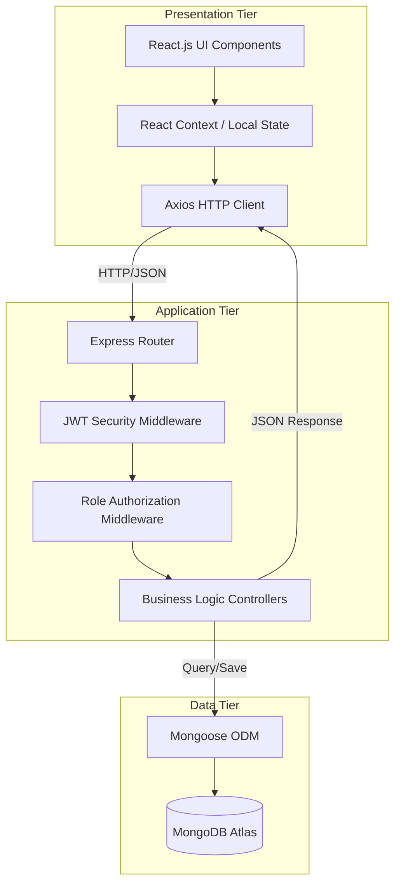

<div align="center">

**STUDENT RESULT MANAGEMENT SYSTEM WITH ROLE-BASED ACCESS CONTROL AND AI INTEGRATION (SRMS-RBAC-AI)**

<br><br>
**A PROJECT REPORT**
<br><br>

Submitted by
<br><br>

**[NAME OF THE CANDIDATE 1]**<br>
**[NAME OF THE CANDIDATE 2]**
<br><br>

in partial fulfillment for the award of the degree
<br>
of
<br><br>

**BACHELOR OF ENGINEERING**
<br><br>

IN
<br><br>

**COMPUTER SCIENCE AND ENGINEERING**
<br><br>

**[NAME OF THE COLLEGE]**
<br><br>

**ANNA UNIVERSITY : CHENNAI 600 025**
<br><br>

**[MONTH & YEAR]**

</div>

<div style="page-break-after: always;"></div>

<div align="center">

**ANNA UNIVERSITY : CHENNAI 600 025**

**BONAFIDE CERTIFICATE**

</div>
<br><br>

Certified that this project report **"STUDENT RESULT MANAGEMENT SYSTEM WITH ROLE-BASED ACCESS CONTROL AND AI INTEGRATION (SRMS-RBAC-AI)"** is the bonafide work of **"[NAME OF THE CANDIDATE 1], [NAME OF THE CANDIDATE 2]"** who carried out the project work under my supervision.

<br><br><br><br>

**SIGNATURE** &nbsp;&nbsp;&nbsp;&nbsp;&nbsp;&nbsp;&nbsp;&nbsp;&nbsp;&nbsp;&nbsp;&nbsp;&nbsp;&nbsp;&nbsp;&nbsp;&nbsp;&nbsp;&nbsp;&nbsp;&nbsp;&nbsp;&nbsp;&nbsp;&nbsp;&nbsp;&nbsp;&nbsp;&nbsp;&nbsp;&nbsp;&nbsp;&nbsp;&nbsp;&nbsp;&nbsp;&nbsp;&nbsp;&nbsp;&nbsp;&nbsp;&nbsp;&nbsp;&nbsp;&nbsp;&nbsp;&nbsp;&nbsp;&nbsp;&nbsp;&nbsp;&nbsp;&nbsp;&nbsp;&nbsp;&nbsp;&nbsp;&nbsp;&nbsp;&nbsp; **SIGNATURE**
<br>
**[NAME OF HOD]** &nbsp;&nbsp;&nbsp;&nbsp;&nbsp;&nbsp;&nbsp;&nbsp;&nbsp;&nbsp;&nbsp;&nbsp;&nbsp;&nbsp;&nbsp;&nbsp;&nbsp;&nbsp;&nbsp;&nbsp;&nbsp;&nbsp;&nbsp;&nbsp;&nbsp;&nbsp;&nbsp;&nbsp;&nbsp;&nbsp;&nbsp;&nbsp;&nbsp;&nbsp;&nbsp;&nbsp;&nbsp;&nbsp;&nbsp;&nbsp;&nbsp;&nbsp;&nbsp;&nbsp;&nbsp;&nbsp;&nbsp;&nbsp;&nbsp;&nbsp;&nbsp;&nbsp; **[NAME OF SUPERVISOR]**
<br>
**HEAD OF THE DEPARTMENT** &nbsp;&nbsp;&nbsp;&nbsp;&nbsp;&nbsp;&nbsp;&nbsp;&nbsp;&nbsp;&nbsp;&nbsp;&nbsp;&nbsp;&nbsp;&nbsp;&nbsp;&nbsp;&nbsp;&nbsp;&nbsp;&nbsp;&nbsp;&nbsp;&nbsp;&nbsp;&nbsp;&nbsp;&nbsp;&nbsp; **SUPERVISOR**
<br>
[Academic Designation] &nbsp;&nbsp;&nbsp;&nbsp;&nbsp;&nbsp;&nbsp;&nbsp;&nbsp;&nbsp;&nbsp;&nbsp;&nbsp;&nbsp;&nbsp;&nbsp;&nbsp;&nbsp;&nbsp;&nbsp;&nbsp;&nbsp;&nbsp;&nbsp;&nbsp;&nbsp;&nbsp;&nbsp;&nbsp;&nbsp;&nbsp;&nbsp;&nbsp;&nbsp;&nbsp;&nbsp;&nbsp;&nbsp;&nbsp;&nbsp;&nbsp;&nbsp;&nbsp; [Academic Designation]
<br>
[Department Name] &nbsp;&nbsp;&nbsp;&nbsp;&nbsp;&nbsp;&nbsp;&nbsp;&nbsp;&nbsp;&nbsp;&nbsp;&nbsp;&nbsp;&nbsp;&nbsp;&nbsp;&nbsp;&nbsp;&nbsp;&nbsp;&nbsp;&nbsp;&nbsp;&nbsp;&nbsp;&nbsp;&nbsp;&nbsp;&nbsp;&nbsp;&nbsp;&nbsp;&nbsp;&nbsp;&nbsp;&nbsp;&nbsp;&nbsp;&nbsp;&nbsp;&nbsp;&nbsp;&nbsp;&nbsp;&nbsp;&nbsp;&nbsp; [Department Name]
<br>
[Full Address of College] &nbsp;&nbsp;&nbsp;&nbsp;&nbsp;&nbsp;&nbsp;&nbsp;&nbsp;&nbsp;&nbsp;&nbsp;&nbsp;&nbsp;&nbsp;&nbsp;&nbsp;&nbsp;&nbsp;&nbsp;&nbsp;&nbsp;&nbsp;&nbsp;&nbsp;&nbsp;&nbsp;&nbsp;&nbsp;&nbsp;&nbsp;&nbsp;&nbsp;&nbsp;&nbsp;&nbsp;&nbsp;&nbsp;&nbsp;&nbsp;&nbsp;&nbsp; [Full Address of College]

<div style="page-break-after: always;"></div>

<div align="center">
**ABSTRACT**
</div>
<br>

The Student Result Management System with Role-Based Access Control and AI Integration (SRMS-RBAC-AI) is a sophisticated, high-performance web ecosystem engineered to modernize institutional academic data governance. In contemporary educational environments, the sheer volume of data—comprising thousands of student profiles, daily attendance logs, and complex examination metrics—renders traditional manual or fragmented digital systems obsolete. These legacy methods often suffer from severe synchronization latency, critical security vulnerabilities regarding unauthorized data manipulation, and a complete lack of real-time auditing capabilities for higher management. 

This project addresses these fundamental bottlenecks by implementing a centralized, API-first architecture utilizing the MERN stack (MongoDB, Express.js, React.js, Node.js). The system is underpinned by a mathematically rigorous Role-Based Access Control (RBAC) matrix that isolates user operations into four distinct tiers: Administrator, Head of Department (HOD), Faculty, and Student. This ensures that sensitive data mutations, such as entering examination marks or modifying attendance records, are strictly confined to authorized personnel, while providing transparent, read-only visibility to end-users.

The backend infrastructure is built on Node.js and Express.js, delivering a suite of RESTful APIs secured through JSON Web Token (JWT) session validation and bcrypt cryptographic hashing. Data persistence is managed via MongoDB, leveraging its schema flexibility to represent hierarchical academic relationships (e.g., Department -> Section -> Subject -> Student) without the performance overhead of traditional relational joins. The frontend, constructed with React.js and compiled via Vite, provides a responsive Single Page Application (SPA) experience. It integrates advanced client-side processing, utilizing Recharts for real-time analytics and libraries like jsPDF for on-the-fly report generation, effectively offloading heavy compute tasks from the server. Furthermore, the modular architecture incorporates preliminary scaffolding for WebAuthn/FIDO2 biometric security, ensuring the platform remains future-proof. Ultimately, SRMS-RBAC-AI provides a resilient, optimized, and secure framework for institutional excellence in the digital age.

<div style="page-break-after: always;"></div>

<div align="center">
**TABLE OF CONTENTS**
</div>
<br>

**CHAPTER NO.** &nbsp;&nbsp;&nbsp;&nbsp;&nbsp;&nbsp;&nbsp;&nbsp;&nbsp;&nbsp;&nbsp;&nbsp;&nbsp;&nbsp;&nbsp;&nbsp;&nbsp;&nbsp;&nbsp;&nbsp;&nbsp;&nbsp;&nbsp; **TITLE** &nbsp;&nbsp;&nbsp;&nbsp;&nbsp;&nbsp;&nbsp;&nbsp;&nbsp;&nbsp;&nbsp;&nbsp;&nbsp;&nbsp;&nbsp;&nbsp;&nbsp;&nbsp;&nbsp;&nbsp;&nbsp;&nbsp;&nbsp;&nbsp;&nbsp;&nbsp;&nbsp;&nbsp;&nbsp;&nbsp;&nbsp;&nbsp;&nbsp;&nbsp;&nbsp;&nbsp;&nbsp;&nbsp;&nbsp;&nbsp;&nbsp;&nbsp;&nbsp;&nbsp;&nbsp;&nbsp;&nbsp;&nbsp;&nbsp;&nbsp;&nbsp;&nbsp;&nbsp; **PAGE NO.**
&nbsp;&nbsp;&nbsp;&nbsp;&nbsp;&nbsp;&nbsp;&nbsp;&nbsp;&nbsp;&nbsp;&nbsp;&nbsp;&nbsp;&nbsp;&nbsp;&nbsp;&nbsp;&nbsp;&nbsp;&nbsp;&nbsp;&nbsp;&nbsp;&nbsp;&nbsp;&nbsp;&nbsp;&nbsp;&nbsp;&nbsp;&nbsp;&nbsp;&nbsp;&nbsp;&nbsp;&nbsp;&nbsp;&nbsp;&nbsp;&nbsp;&nbsp;&nbsp;&nbsp;&nbsp;&nbsp;&nbsp;&nbsp;&nbsp; ABSTRACT &nbsp;&nbsp;&nbsp;&nbsp;&nbsp;&nbsp;&nbsp;&nbsp;&nbsp;&nbsp;&nbsp;&nbsp;&nbsp;&nbsp;&nbsp;&nbsp;&nbsp;&nbsp;&nbsp;&nbsp;&nbsp;&nbsp;&nbsp;&nbsp;&nbsp;&nbsp;&nbsp;&nbsp;&nbsp;&nbsp;&nbsp;&nbsp;&nbsp;&nbsp;&nbsp;&nbsp;&nbsp;&nbsp;&nbsp;&nbsp;&nbsp;&nbsp;&nbsp;&nbsp;&nbsp;&nbsp;&nbsp;&nbsp;&nbsp;&nbsp;&nbsp;&nbsp;&nbsp;&nbsp; iii
&nbsp;&nbsp;&nbsp;&nbsp;&nbsp;&nbsp;&nbsp;&nbsp;&nbsp;&nbsp;&nbsp;&nbsp;&nbsp;&nbsp;&nbsp;&nbsp;&nbsp;&nbsp;&nbsp;&nbsp;&nbsp;&nbsp;&nbsp;&nbsp;&nbsp;&nbsp;&nbsp;&nbsp;&nbsp;&nbsp;&nbsp;&nbsp;&nbsp;&nbsp;&nbsp;&nbsp;&nbsp;&nbsp;&nbsp;&nbsp;&nbsp;&nbsp;&nbsp;&nbsp;&nbsp;&nbsp;&nbsp;&nbsp;&nbsp; LIST OF FIGURES &nbsp;&nbsp;&nbsp;&nbsp;&nbsp;&nbsp;&nbsp;&nbsp;&nbsp;&nbsp;&nbsp;&nbsp;&nbsp;&nbsp;&nbsp;&nbsp;&nbsp;&nbsp;&nbsp;&nbsp;&nbsp;&nbsp;&nbsp;&nbsp;&nbsp;&nbsp;&nbsp;&nbsp;&nbsp;&nbsp;&nbsp;&nbsp;&nbsp;&nbsp;&nbsp;&nbsp;&nbsp;&nbsp;&nbsp;&nbsp;&nbsp;&nbsp;&nbsp; vi

**1.** &nbsp;&nbsp;&nbsp;&nbsp;&nbsp;&nbsp;&nbsp;&nbsp;&nbsp;&nbsp;&nbsp;&nbsp;&nbsp;&nbsp;&nbsp;&nbsp;&nbsp;&nbsp;&nbsp;&nbsp;&nbsp;&nbsp;&nbsp;&nbsp;&nbsp;&nbsp;&nbsp;&nbsp;&nbsp;&nbsp;&nbsp;&nbsp;&nbsp;&nbsp;&nbsp;&nbsp;&nbsp;&nbsp;&nbsp;&nbsp;&nbsp;&nbsp;&nbsp; **INTRODUCTION** &nbsp;&nbsp;&nbsp;&nbsp;&nbsp;&nbsp;&nbsp;&nbsp;&nbsp;&nbsp;&nbsp;&nbsp;&nbsp;&nbsp;&nbsp;&nbsp;&nbsp;&nbsp;&nbsp;&nbsp;&nbsp;&nbsp;&nbsp;&nbsp;&nbsp;&nbsp;&nbsp;&nbsp;&nbsp;&nbsp;&nbsp;&nbsp;&nbsp;&nbsp;&nbsp;&nbsp;&nbsp;&nbsp;&nbsp;&nbsp; **1**
&nbsp;&nbsp;&nbsp;&nbsp;&nbsp;&nbsp;&nbsp;&nbsp;&nbsp; 1.1 &nbsp;&nbsp;&nbsp;&nbsp;&nbsp;&nbsp;&nbsp;&nbsp;&nbsp;&nbsp;&nbsp;&nbsp;&nbsp;&nbsp;&nbsp;&nbsp;&nbsp;&nbsp;&nbsp;&nbsp;&nbsp;&nbsp;&nbsp;&nbsp;&nbsp;&nbsp;&nbsp;&nbsp;&nbsp;&nbsp;&nbsp;&nbsp;&nbsp; GENERAL OVERVIEW &nbsp;&nbsp;&nbsp;&nbsp;&nbsp;&nbsp;&nbsp;&nbsp;&nbsp;&nbsp;&nbsp;&nbsp;&nbsp;&nbsp;&nbsp;&nbsp;&nbsp;&nbsp;&nbsp;&nbsp;&nbsp;&nbsp;&nbsp;&nbsp;&nbsp;&nbsp;&nbsp;&nbsp;&nbsp;&nbsp;&nbsp;&nbsp; 1
&nbsp;&nbsp;&nbsp;&nbsp;&nbsp;&nbsp;&nbsp;&nbsp;&nbsp; 1.2 &nbsp;&nbsp;&nbsp;&nbsp;&nbsp;&nbsp;&nbsp;&nbsp;&nbsp;&nbsp;&nbsp;&nbsp;&nbsp;&nbsp;&nbsp;&nbsp;&nbsp;&nbsp;&nbsp;&nbsp;&nbsp;&nbsp;&nbsp;&nbsp;&nbsp;&nbsp;&nbsp;&nbsp;&nbsp;&nbsp;&nbsp;&nbsp;&nbsp; LIMITATIONS OF LEGACY SYSTEMS &nbsp;&nbsp;&nbsp;&nbsp;&nbsp;&nbsp;&nbsp;&nbsp;&nbsp;&nbsp; 3
&nbsp;&nbsp;&nbsp;&nbsp;&nbsp;&nbsp;&nbsp;&nbsp;&nbsp; 1.3 &nbsp;&nbsp;&nbsp;&nbsp;&nbsp;&nbsp;&nbsp;&nbsp;&nbsp;&nbsp;&nbsp;&nbsp;&nbsp;&nbsp;&nbsp;&nbsp;&nbsp;&nbsp;&nbsp;&nbsp;&nbsp;&nbsp;&nbsp;&nbsp;&nbsp;&nbsp;&nbsp;&nbsp;&nbsp;&nbsp;&nbsp;&nbsp;&nbsp; ENGINEERING DECISIONS &nbsp;&nbsp;&nbsp;&nbsp;&nbsp;&nbsp;&nbsp;&nbsp;&nbsp;&nbsp;&nbsp;&nbsp;&nbsp;&nbsp;&nbsp;&nbsp;&nbsp;&nbsp;&nbsp;&nbsp;&nbsp;&nbsp;&nbsp; 5
&nbsp;&nbsp;&nbsp;&nbsp;&nbsp;&nbsp;&nbsp;&nbsp;&nbsp;&nbsp;&nbsp;&nbsp;&nbsp;&nbsp;&nbsp;&nbsp;&nbsp; 1.3.1 &nbsp;&nbsp;&nbsp;&nbsp;&nbsp;&nbsp;&nbsp;&nbsp;&nbsp;&nbsp;&nbsp;&nbsp;&nbsp;&nbsp;&nbsp;&nbsp;&nbsp;&nbsp;&nbsp;&nbsp;&nbsp; Technology Stack Selection &nbsp;&nbsp;&nbsp;&nbsp;&nbsp;&nbsp;&nbsp;&nbsp;&nbsp;&nbsp;&nbsp;&nbsp;&nbsp;&nbsp;&nbsp;&nbsp;&nbsp;&nbsp;&nbsp;&nbsp;&nbsp;&nbsp;&nbsp;&nbsp;&nbsp; 6
&nbsp;&nbsp;&nbsp;&nbsp;&nbsp;&nbsp;&nbsp;&nbsp;&nbsp;&nbsp;&nbsp;&nbsp;&nbsp;&nbsp;&nbsp;&nbsp;&nbsp; 1.3.2 &nbsp;&nbsp;&nbsp;&nbsp;&nbsp;&nbsp;&nbsp;&nbsp;&nbsp;&nbsp;&nbsp;&nbsp;&nbsp;&nbsp;&nbsp;&nbsp;&nbsp;&nbsp;&nbsp;&nbsp;&nbsp; Architecture: Monolithic vs Microservices &nbsp;&nbsp;&nbsp;&nbsp;&nbsp; 8
&nbsp;&nbsp;&nbsp;&nbsp;&nbsp;&nbsp;&nbsp;&nbsp;&nbsp;&nbsp;&nbsp;&nbsp;&nbsp;&nbsp;&nbsp;&nbsp;&nbsp; 1.3.3 &nbsp;&nbsp;&nbsp;&nbsp;&nbsp;&nbsp;&nbsp;&nbsp;&nbsp;&nbsp;&nbsp;&nbsp;&nbsp;&nbsp;&nbsp;&nbsp;&nbsp;&nbsp;&nbsp;&nbsp;&nbsp; Scalability & Performance Trade-offs &nbsp;&nbsp;&nbsp;&nbsp;&nbsp;&nbsp;&nbsp;&nbsp;&nbsp;&nbsp; 10

**2.** &nbsp;&nbsp;&nbsp;&nbsp;&nbsp;&nbsp;&nbsp;&nbsp;&nbsp;&nbsp;&nbsp;&nbsp;&nbsp;&nbsp;&nbsp;&nbsp;&nbsp;&nbsp;&nbsp;&nbsp;&nbsp;&nbsp;&nbsp;&nbsp;&nbsp;&nbsp;&nbsp;&nbsp;&nbsp;&nbsp;&nbsp;&nbsp;&nbsp;&nbsp;&nbsp;&nbsp;&nbsp;&nbsp;&nbsp;&nbsp;&nbsp;&nbsp;&nbsp; **SYSTEM ARCHITECTURE** &nbsp;&nbsp;&nbsp;&nbsp;&nbsp;&nbsp;&nbsp;&nbsp;&nbsp;&nbsp;&nbsp;&nbsp;&nbsp;&nbsp;&nbsp;&nbsp;&nbsp;&nbsp;&nbsp;&nbsp;&nbsp;&nbsp;&nbsp;&nbsp; **12**
&nbsp;&nbsp;&nbsp;&nbsp;&nbsp;&nbsp;&nbsp;&nbsp;&nbsp; 2.1 &nbsp;&nbsp;&nbsp;&nbsp;&nbsp;&nbsp;&nbsp;&nbsp;&nbsp;&nbsp;&nbsp;&nbsp;&nbsp;&nbsp;&nbsp;&nbsp;&nbsp;&nbsp;&nbsp;&nbsp;&nbsp;&nbsp;&nbsp;&nbsp;&nbsp;&nbsp;&nbsp;&nbsp;&nbsp;&nbsp;&nbsp;&nbsp;&nbsp; LAYERED INTERACTION MODEL &nbsp;&nbsp;&nbsp;&nbsp;&nbsp;&nbsp;&nbsp;&nbsp;&nbsp;&nbsp;&nbsp;&nbsp;&nbsp;&nbsp;&nbsp;&nbsp;&nbsp;&nbsp; 12
&nbsp;&nbsp;&nbsp;&nbsp;&nbsp;&nbsp;&nbsp;&nbsp;&nbsp; 2.2 &nbsp;&nbsp;&nbsp;&nbsp;&nbsp;&nbsp;&nbsp;&nbsp;&nbsp;&nbsp;&nbsp;&nbsp;&nbsp;&nbsp;&nbsp;&nbsp;&nbsp;&nbsp;&nbsp;&nbsp;&nbsp;&nbsp;&nbsp;&nbsp;&nbsp;&nbsp;&nbsp;&nbsp;&nbsp;&nbsp;&nbsp;&nbsp;&nbsp; DATA FLOW ARCHITECTURE &nbsp;&nbsp;&nbsp;&nbsp;&nbsp;&nbsp;&nbsp;&nbsp;&nbsp;&nbsp;&nbsp;&nbsp;&nbsp;&nbsp;&nbsp;&nbsp;&nbsp;&nbsp;&nbsp;&nbsp; 15
&nbsp;&nbsp;&nbsp;&nbsp;&nbsp;&nbsp;&nbsp;&nbsp;&nbsp; 2.3 &nbsp;&nbsp;&nbsp;&nbsp;&nbsp;&nbsp;&nbsp;&nbsp;&nbsp;&nbsp;&nbsp;&nbsp;&nbsp;&nbsp;&nbsp;&nbsp;&nbsp;&nbsp;&nbsp;&nbsp;&nbsp;&nbsp;&nbsp;&nbsp;&nbsp;&nbsp;&nbsp;&nbsp;&nbsp;&nbsp;&nbsp;&nbsp;&nbsp; DATABASE SCHEMA DESIGN &nbsp;&nbsp;&nbsp;&nbsp;&nbsp;&nbsp;&nbsp;&nbsp;&nbsp;&nbsp;&nbsp;&nbsp;&nbsp;&nbsp;&nbsp;&nbsp;&nbsp;&nbsp; 18
&nbsp;&nbsp;&nbsp;&nbsp;&nbsp;&nbsp;&nbsp;&nbsp;&nbsp; 2.4 &nbsp;&nbsp;&nbsp;&nbsp;&nbsp;&nbsp;&nbsp;&nbsp;&nbsp;&nbsp;&nbsp;&nbsp;&nbsp;&nbsp;&nbsp;&nbsp;&nbsp;&nbsp;&nbsp;&nbsp;&nbsp;&nbsp;&nbsp;&nbsp;&nbsp;&nbsp;&nbsp;&nbsp;&nbsp;&nbsp;&nbsp;&nbsp;&nbsp; ROLE-BASED ACCESS CONTROL (RBAC) &nbsp;&nbsp;&nbsp;&nbsp;&nbsp;&nbsp; 22

**3.** &nbsp;&nbsp;&nbsp;&nbsp;&nbsp;&nbsp;&nbsp;&nbsp;&nbsp;&nbsp;&nbsp;&nbsp;&nbsp;&nbsp;&nbsp;&nbsp;&nbsp;&nbsp;&nbsp;&nbsp;&nbsp;&nbsp;&nbsp;&nbsp;&nbsp;&nbsp;&nbsp;&nbsp;&nbsp;&nbsp;&nbsp;&nbsp;&nbsp;&nbsp;&nbsp;&nbsp;&nbsp;&nbsp;&nbsp;&nbsp;&nbsp;&nbsp;&nbsp; **IMPLEMENTATION & MODULES** &nbsp;&nbsp;&nbsp;&nbsp;&nbsp;&nbsp;&nbsp;&nbsp;&nbsp;&nbsp;&nbsp;&nbsp; **26**
&nbsp;&nbsp;&nbsp;&nbsp;&nbsp;&nbsp;&nbsp;&nbsp;&nbsp; 3.1 &nbsp;&nbsp;&nbsp;&nbsp;&nbsp;&nbsp;&nbsp;&nbsp;&nbsp;&nbsp;&nbsp;&nbsp;&nbsp;&nbsp;&nbsp;&nbsp;&nbsp;&nbsp;&nbsp;&nbsp;&nbsp;&nbsp;&nbsp;&nbsp;&nbsp;&nbsp;&nbsp;&nbsp;&nbsp;&nbsp;&nbsp;&nbsp;&nbsp; AUTHENTICATION & SECURITY LOGIC &nbsp;&nbsp;&nbsp;&nbsp;&nbsp;&nbsp;&nbsp;&nbsp; 26
&nbsp;&nbsp;&nbsp;&nbsp;&nbsp;&nbsp;&nbsp;&nbsp;&nbsp; 3.2 &nbsp;&nbsp;&nbsp;&nbsp;&nbsp;&nbsp;&nbsp;&nbsp;&nbsp;&nbsp;&nbsp;&nbsp;&nbsp;&nbsp;&nbsp;&nbsp;&nbsp;&nbsp;&nbsp;&nbsp;&nbsp;&nbsp;&nbsp;&nbsp;&nbsp;&nbsp;&nbsp;&nbsp;&nbsp;&nbsp;&nbsp;&nbsp;&nbsp; ACADEMIC SETUP & INTEGRITY CHECKS &nbsp;&nbsp;&nbsp;&nbsp;&nbsp;&nbsp; 30
&nbsp;&nbsp;&nbsp;&nbsp;&nbsp;&nbsp;&nbsp;&nbsp;&nbsp; 3.3 &nbsp;&nbsp;&nbsp;&nbsp;&nbsp;&nbsp;&nbsp;&nbsp;&nbsp;&nbsp;&nbsp;&nbsp;&nbsp;&nbsp;&nbsp;&nbsp;&nbsp;&nbsp;&nbsp;&nbsp;&nbsp;&nbsp;&nbsp;&nbsp;&nbsp;&nbsp;&nbsp;&nbsp;&nbsp;&nbsp;&nbsp;&nbsp;&nbsp; ATTENDANCE MANAGEMENT LOGIC &nbsp;&nbsp;&nbsp;&nbsp;&nbsp;&nbsp;&nbsp;&nbsp;&nbsp; 35
&nbsp;&nbsp;&nbsp;&nbsp;&nbsp;&nbsp;&nbsp;&nbsp;&nbsp; 3.4 &nbsp;&nbsp;&nbsp;&nbsp;&nbsp;&nbsp;&nbsp;&nbsp;&nbsp;&nbsp;&nbsp;&nbsp;&nbsp;&nbsp;&nbsp;&nbsp;&nbsp;&nbsp;&nbsp;&nbsp;&nbsp;&nbsp;&nbsp;&nbsp;&nbsp;&nbsp;&nbsp;&nbsp;&nbsp;&nbsp;&nbsp;&nbsp;&nbsp; MARKS & RESULTS WORKFLOW &nbsp;&nbsp;&nbsp;&nbsp;&nbsp;&nbsp;&nbsp;&nbsp;&nbsp;&nbsp;&nbsp;&nbsp;&nbsp;&nbsp;&nbsp; 41
&nbsp;&nbsp;&nbsp;&nbsp;&nbsp;&nbsp;&nbsp;&nbsp;&nbsp; 3.5 &nbsp;&nbsp;&nbsp;&nbsp;&nbsp;&nbsp;&nbsp;&nbsp;&nbsp;&nbsp;&nbsp;&nbsp;&nbsp;&nbsp;&nbsp;&nbsp;&nbsp;&nbsp;&nbsp;&nbsp;&nbsp;&nbsp;&nbsp;&nbsp;&nbsp;&nbsp;&nbsp;&nbsp;&nbsp;&nbsp;&nbsp;&nbsp;&nbsp; HIGH-SPEED BULK UPLOAD OPTIMIZATION 47

**4.** &nbsp;&nbsp;&nbsp;&nbsp;&nbsp;&nbsp;&nbsp;&nbsp;&nbsp;&nbsp;&nbsp;&nbsp;&nbsp;&nbsp;&nbsp;&nbsp;&nbsp;&nbsp;&nbsp;&nbsp;&nbsp;&nbsp;&nbsp;&nbsp;&nbsp;&nbsp;&nbsp;&nbsp;&nbsp;&nbsp;&nbsp;&nbsp;&nbsp;&nbsp;&nbsp;&nbsp;&nbsp;&nbsp;&nbsp;&nbsp;&nbsp;&nbsp;&nbsp; **UI/UX & FRONTEND ARCHITECTURE** &nbsp;&nbsp;&nbsp; **52**
&nbsp;&nbsp;&nbsp;&nbsp;&nbsp;&nbsp;&nbsp;&nbsp;&nbsp; 4.1 &nbsp;&nbsp;&nbsp;&nbsp;&nbsp;&nbsp;&nbsp;&nbsp;&nbsp;&nbsp;&nbsp;&nbsp;&nbsp;&nbsp;&nbsp;&nbsp;&nbsp;&nbsp;&nbsp;&nbsp;&nbsp;&nbsp;&nbsp;&nbsp;&nbsp;&nbsp;&nbsp;&nbsp;&nbsp;&nbsp;&nbsp;&nbsp;&nbsp; ROLE-SPECIFIC DASHBOARD DESIGN &nbsp;&nbsp;&nbsp;&nbsp;&nbsp;&nbsp;&nbsp; 52
&nbsp;&nbsp;&nbsp;&nbsp;&nbsp;&nbsp;&nbsp;&nbsp;&nbsp; 4.2 &nbsp;&nbsp;&nbsp;&nbsp;&nbsp;&nbsp;&nbsp;&nbsp;&nbsp;&nbsp;&nbsp;&nbsp;&nbsp;&nbsp;&nbsp;&nbsp;&nbsp;&nbsp;&nbsp;&nbsp;&nbsp;&nbsp;&nbsp;&nbsp;&nbsp;&nbsp;&nbsp;&nbsp;&nbsp;&nbsp;&nbsp;&nbsp;&nbsp; STATE MANAGEMENT & API CACHING &nbsp;&nbsp;&nbsp;&nbsp;&nbsp;&nbsp;&nbsp; 56

**5.** &nbsp;&nbsp;&nbsp;&nbsp;&nbsp;&nbsp;&nbsp;&nbsp;&nbsp;&nbsp;&nbsp;&nbsp;&nbsp;&nbsp;&nbsp;&nbsp;&nbsp;&nbsp;&nbsp;&nbsp;&nbsp;&nbsp;&nbsp;&nbsp;&nbsp;&nbsp;&nbsp;&nbsp;&nbsp;&nbsp;&nbsp;&nbsp;&nbsp;&nbsp;&nbsp;&nbsp;&nbsp;&nbsp;&nbsp;&nbsp;&nbsp;&nbsp;&nbsp; **SOFTWARE TESTING STRATEGY** &nbsp;&nbsp;&nbsp;&nbsp;&nbsp;&nbsp;&nbsp;&nbsp;&nbsp;&nbsp; **60**
&nbsp;&nbsp;&nbsp;&nbsp;&nbsp;&nbsp;&nbsp;&nbsp;&nbsp; 5.1 &nbsp;&nbsp;&nbsp;&nbsp;&nbsp;&nbsp;&nbsp;&nbsp;&nbsp;&nbsp;&nbsp;&nbsp;&nbsp;&nbsp;&nbsp;&nbsp;&nbsp;&nbsp;&nbsp;&nbsp;&nbsp;&nbsp;&nbsp;&nbsp;&nbsp;&nbsp;&nbsp;&nbsp;&nbsp;&nbsp;&nbsp;&nbsp;&nbsp; API ENDPOINT VALIDATION &nbsp;&nbsp;&nbsp;&nbsp;&nbsp;&nbsp;&nbsp;&nbsp;&nbsp;&nbsp;&nbsp;&nbsp;&nbsp;&nbsp;&nbsp;&nbsp;&nbsp;&nbsp; 60
&nbsp;&nbsp;&nbsp;&nbsp;&nbsp;&nbsp;&nbsp;&nbsp;&nbsp; 5.2 &nbsp;&nbsp;&nbsp;&nbsp;&nbsp;&nbsp;&nbsp;&nbsp;&nbsp;&nbsp;&nbsp;&nbsp;&nbsp;&nbsp;&nbsp;&nbsp;&nbsp;&nbsp;&nbsp;&nbsp;&nbsp;&nbsp;&nbsp;&nbsp;&nbsp;&nbsp;&nbsp;&nbsp;&nbsp;&nbsp;&nbsp;&nbsp;&nbsp; REALISTIC TEST CASE SCENARIOS &nbsp;&nbsp;&nbsp;&nbsp;&nbsp;&nbsp;&nbsp;&nbsp; 63

**6.** &nbsp;&nbsp;&nbsp;&nbsp;&nbsp;&nbsp;&nbsp;&nbsp;&nbsp;&nbsp;&nbsp;&nbsp;&nbsp;&nbsp;&nbsp;&nbsp;&nbsp;&nbsp;&nbsp;&nbsp;&nbsp;&nbsp;&nbsp;&nbsp;&nbsp;&nbsp;&nbsp;&nbsp;&nbsp;&nbsp;&nbsp;&nbsp;&nbsp;&nbsp;&nbsp;&nbsp;&nbsp;&nbsp;&nbsp;&nbsp;&nbsp;&nbsp;&nbsp; **CONCLUSION** &nbsp;&nbsp;&nbsp;&nbsp;&nbsp;&nbsp;&nbsp;&nbsp;&nbsp;&nbsp;&nbsp;&nbsp;&nbsp;&nbsp;&nbsp;&nbsp;&nbsp;&nbsp;&nbsp;&nbsp;&nbsp;&nbsp;&nbsp;&nbsp;&nbsp;&nbsp;&nbsp;&nbsp;&nbsp;&nbsp;&nbsp;&nbsp;&nbsp;&nbsp;&nbsp;&nbsp;&nbsp;&nbsp;&nbsp;&nbsp;&nbsp;&nbsp; **68**
&nbsp;&nbsp;&nbsp;&nbsp;&nbsp;&nbsp;&nbsp;&nbsp;&nbsp;&nbsp;&nbsp;&nbsp;&nbsp;&nbsp;&nbsp;&nbsp;&nbsp;&nbsp;&nbsp;&nbsp;&nbsp;&nbsp;&nbsp;&nbsp;&nbsp;&nbsp;&nbsp;&nbsp;&nbsp;&nbsp;&nbsp;&nbsp;&nbsp;&nbsp;&nbsp;&nbsp;&nbsp;&nbsp;&nbsp;&nbsp;&nbsp;&nbsp;&nbsp;&nbsp;&nbsp;&nbsp;&nbsp;&nbsp;&nbsp; **APPENDICES** &nbsp;&nbsp;&nbsp;&nbsp;&nbsp;&nbsp;&nbsp;&nbsp;&nbsp;&nbsp;&nbsp;&nbsp;&nbsp;&nbsp;&nbsp;&nbsp;&nbsp;&nbsp;&nbsp;&nbsp;&nbsp;&nbsp;&nbsp;&nbsp;&nbsp;&nbsp;&nbsp;&nbsp;&nbsp;&nbsp;&nbsp;&nbsp;&nbsp;&nbsp;&nbsp;&nbsp;&nbsp;&nbsp;&nbsp;&nbsp;&nbsp;&nbsp; 71
&nbsp;&nbsp;&nbsp;&nbsp;&nbsp;&nbsp;&nbsp;&nbsp;&nbsp;&nbsp;&nbsp;&nbsp;&nbsp;&nbsp;&nbsp;&nbsp;&nbsp;&nbsp;&nbsp;&nbsp;&nbsp;&nbsp;&nbsp;&nbsp;&nbsp;&nbsp;&nbsp;&nbsp;&nbsp;&nbsp;&nbsp;&nbsp;&nbsp;&nbsp;&nbsp;&nbsp;&nbsp;&nbsp;&nbsp;&nbsp;&nbsp;&nbsp;&nbsp;&nbsp;&nbsp;&nbsp;&nbsp;&nbsp;&nbsp; **REFERENCES** &nbsp;&nbsp;&nbsp;&nbsp;&nbsp;&nbsp;&nbsp;&nbsp;&nbsp;&nbsp;&nbsp;&nbsp;&nbsp;&nbsp;&nbsp;&nbsp;&nbsp;&nbsp;&nbsp;&nbsp;&nbsp;&nbsp;&nbsp;&nbsp;&nbsp;&nbsp;&nbsp;&nbsp;&nbsp;&nbsp;&nbsp;&nbsp;&nbsp;&nbsp;&nbsp;&nbsp;&nbsp;&nbsp;&nbsp;&nbsp;&nbsp; 75

<div style="page-break-after: always;"></div>

<div align="center">
**LIST OF FIGURES**
</div>
<br>

**FIGURE NO.** &nbsp;&nbsp;&nbsp;&nbsp;&nbsp;&nbsp;&nbsp;&nbsp;&nbsp;&nbsp;&nbsp;&nbsp;&nbsp;&nbsp;&nbsp;&nbsp;&nbsp;&nbsp;&nbsp;&nbsp;&nbsp;&nbsp;&nbsp;&nbsp;&nbsp;&nbsp;&nbsp;&nbsp;&nbsp; **TITLE** &nbsp;&nbsp;&nbsp;&nbsp;&nbsp;&nbsp;&nbsp;&nbsp;&nbsp;&nbsp;&nbsp;&nbsp;&nbsp;&nbsp;&nbsp;&nbsp;&nbsp;&nbsp;&nbsp;&nbsp;&nbsp;&nbsp;&nbsp;&nbsp;&nbsp;&nbsp;&nbsp;&nbsp;&nbsp;&nbsp;&nbsp;&nbsp;&nbsp;&nbsp;&nbsp;&nbsp;&nbsp;&nbsp;&nbsp;&nbsp;&nbsp;&nbsp;&nbsp;&nbsp;&nbsp;&nbsp; **PAGE NO.**
2.1 &nbsp;&nbsp;&nbsp;&nbsp;&nbsp;&nbsp;&nbsp;&nbsp;&nbsp;&nbsp;&nbsp;&nbsp;&nbsp;&nbsp;&nbsp;&nbsp;&nbsp;&nbsp;&nbsp;&nbsp;&nbsp;&nbsp;&nbsp;&nbsp;&nbsp;&nbsp;&nbsp;&nbsp; System Architecture Diagram &nbsp;&nbsp;&nbsp;&nbsp;&nbsp;&nbsp;&nbsp;&nbsp;&nbsp;&nbsp;&nbsp;&nbsp;&nbsp;&nbsp;&nbsp;&nbsp;&nbsp;&nbsp;&nbsp;&nbsp;&nbsp;&nbsp;&nbsp;&nbsp;&nbsp;&nbsp;&nbsp;&nbsp;&nbsp;&nbsp; 14
2.2 &nbsp;&nbsp;&nbsp;&nbsp;&nbsp;&nbsp;&nbsp;&nbsp;&nbsp;&nbsp;&nbsp;&nbsp;&nbsp;&nbsp;&nbsp;&nbsp;&nbsp;&nbsp;&nbsp;&nbsp;&nbsp;&nbsp;&nbsp;&nbsp;&nbsp;&nbsp;&nbsp;&nbsp; Data Flow Interaction Model &nbsp;&nbsp;&nbsp;&nbsp;&nbsp;&nbsp;&nbsp;&nbsp;&nbsp;&nbsp;&nbsp;&nbsp;&nbsp;&nbsp;&nbsp;&nbsp;&nbsp;&nbsp;&nbsp;&nbsp;&nbsp;&nbsp;&nbsp;&nbsp;&nbsp;&nbsp;&nbsp;&nbsp;&nbsp;&nbsp; 17
2.3 &nbsp;&nbsp;&nbsp;&nbsp;&nbsp;&nbsp;&nbsp;&nbsp;&nbsp;&nbsp;&nbsp;&nbsp;&nbsp;&nbsp;&nbsp;&nbsp;&nbsp;&nbsp;&nbsp;&nbsp;&nbsp;&nbsp;&nbsp;&nbsp;&nbsp;&nbsp;&nbsp;&nbsp; Entity Relationship (ER) Diagram &nbsp;&nbsp;&nbsp;&nbsp;&nbsp;&nbsp;&nbsp;&nbsp;&nbsp;&nbsp;&nbsp;&nbsp;&nbsp;&nbsp;&nbsp;&nbsp;&nbsp;&nbsp;&nbsp;&nbsp;&nbsp; 21
3.1 &nbsp;&nbsp;&nbsp;&nbsp;&nbsp;&nbsp;&nbsp;&nbsp;&nbsp;&nbsp;&nbsp;&nbsp;&nbsp;&nbsp;&nbsp;&nbsp;&nbsp;&nbsp;&nbsp;&nbsp;&nbsp;&nbsp;&nbsp;&nbsp;&nbsp;&nbsp;&nbsp;&nbsp; Sequence Diagram (Authentication Flow) &nbsp;&nbsp;&nbsp;&nbsp;&nbsp;&nbsp;&nbsp;&nbsp;&nbsp;&nbsp;&nbsp;&nbsp; 29
3.2 &nbsp;&nbsp;&nbsp;&nbsp;&nbsp;&nbsp;&nbsp;&nbsp;&nbsp;&nbsp;&nbsp;&nbsp;&nbsp;&nbsp;&nbsp;&nbsp;&nbsp;&nbsp;&nbsp;&nbsp;&nbsp;&nbsp;&nbsp;&nbsp;&nbsp;&nbsp;&nbsp;&nbsp; Activity Diagram (Marks Publication Cycle) &nbsp;&nbsp;&nbsp;&nbsp;&nbsp;&nbsp;&nbsp;&nbsp; 44
4.1 &nbsp;&nbsp;&nbsp;&nbsp;&nbsp;&nbsp;&nbsp;&nbsp;&nbsp;&nbsp;&nbsp;&nbsp;&nbsp;&nbsp;&nbsp;&nbsp;&nbsp;&nbsp;&nbsp;&nbsp;&nbsp;&nbsp;&nbsp;&nbsp;&nbsp;&nbsp;&nbsp;&nbsp; UI Hierarchical Structure (Admin Dashboard) &nbsp;&nbsp;&nbsp;&nbsp;&nbsp;&nbsp; 54

<div style="page-break-after: always;"></div>

**1. INTRODUCTION**

**1.1 GENERAL OVERVIEW**

Educational institutions operate as data-intensive environments where the management of student records, attendance, and evaluation metrics constitutes a critical operational backbone. The "Student Result Management System with Role-Based Access Control and AI Integration" (SRMS-RBAC-AI) is an enterprise-grade web application designed to digitize and secure the academic administrative lifecycle. Unlike generic management software, SRMS-RBAC-AI is engineered with a strict focus on data isolation, institutional hierarchy, and real-time analytical visibility.

The primary objective of this system is to replace fragmented, manual processes with a Single Source of Truth (SSOT). By centralizing all academic data—from department configuration to final result publication—into a unified MongoDB database, the system eliminates the redundancies and errors inherent in paper-based or spreadsheet-driven workflows. The core innovation lies in its multi-layered security architecture, ensuring that every byte of data is protected by a cryptographic session validation layer (JWT) and a role-based authorization matrix.

**1.2 LIMITATIONS OF LEGACY SYSTEMS**

To appreciate the architectural necessity of SRMS-RBAC-AI, it is essential to analyze the critical failure points of traditional academic management:

1.  **Data Fragmentation:** In many institutions, student data is scattered across disconnected Excel sheets, paper attendance registers, and local faculty drives. This fragmentation leads to "data silos," where an HOD cannot view a student's aggregate attendance without manually requesting reports from five different faculty members.
2.  **Synchronization Latency:** When attendance is marked on paper, it often takes 24–48 hours for that data to be digitized and visible to administrative oversight. This delay prevents proactive interventions for students with attendance deficits.
3.  **Security Vulnerabilities:** Spreadsheet-based result management lacks a tamper-proof audit trail. Unauthorized modifications to marks or attendance can go undetected due to the absence of a structured logging mechanism and granular permission controls.
4.  **Computational Errors:** Manual calculation of internal assessment scores, attendance percentages, and final grade points is highly susceptible to human error, leading to disputes and administrative rework during the result compilation phase.

**1.3 ENGINEERING DECISIONS**

The development of SRMS-RBAC-AI was guided by specific engineering constraints: the need for high concurrency (multiple faculty marking attendance at the start of a lecture hour), rapid frontend responsiveness, and a highly scalable backend.

**1.3.1 Technology Stack Selection**

The MERN stack (MongoDB, Express.js, React.js, Node.js) was selected as the foundational technology for its inherent synergy and performance characteristics:

*   **JavaScript Unification:** Utilizing JavaScript across both the client (React) and the server (Node.js) significantly reduces "context switching" for developers. This unification allows for the seamless sharing of data models and validation logic across the HTTP boundary. For instance, a JSON payload generated in the React frontend is consumed natively by the Express backend without requiring complex serialization or type-mapping.
*   **Node.js Event-Driven I/O:** Academic systems experience massive usage spikes (e.g., thousands of students checking results simultaneously). Traditional thread-based servers (like Apache) spawn a heavy thread for each request, which can quickly exhaust server RAM. Node.js utilizes an event-loop, non-blocking I/O model. It delegates database operations to the OS kernel, allowing a single thread to handle thousands of concurrent API requests with minimal resource footprint.
*   **MongoDB Schema Flexibility:** Relational databases (SQL) require rigid, predefined tables. Academic data, however, is often hierarchical and subject to change (e.g., adding elective subjects or varying assessment patterns). MongoDB’s BSON format allows for "nested documents," enabling the system to store a student's profile and their semester-wise references in a way that maps naturally to academic structures without the performance penalty of deep SQL joins.

**1.3.2 Architecture: Monolithic vs Microservices**

A critical decision was made to utilize a *Modular Monolithic Architecture* rather than a full Microservices approach. While microservices offer extreme isolation, they introduce significant operational overhead regarding inter-service authentication and data consistency (distributed transactions). 

SRMS-RBAC-AI is built as a single cohesive API, but it is logically partitioned into distinct domains: `AttendanceDomain`, `MarkDomain`, `AuthDomain`, etc. This modularity ensures that the codebase remains maintainable and clean, while avoiding the network latency inherent in microservice communication. This "monolith-first" strategy allows the system to be easily split into microservices in the future if institutional load reaches the scale of hundreds of thousands of concurrent users.

**1.3.3 Scalability & Performance Trade-offs**

*   **Stateless Authentication (JWT):** The system utilizes JSON Web Tokens (JWT) for session management. Traditional sessions store user data in the server's memory. In a load-balanced environment, this requires "sticky sessions" or a centralized Redis cache. JWTs are stateless; the server signs a token and gives it to the client. The server retains zero memory of the session. For every request, the client presents the token, and the server mathematically verifies the signature. This trade-off slightly increases the size of HTTP headers but allows the backend to scale horizontally across multiple server instances without session-sharing complexity.
*   **Client-Side Report Generation:** Offloading computationally intensive tasks like PDF generation (jsPDF) and Excel exporting (XLSX) to the user's browser is a strategic engineering choice. Generating a 100-page transcript for 500 students simultaneously on the server would cause CPU thread blocking. By sending raw JSON data and letting the client's local hardware render the visual documents, the server's resources are preserved exclusively for high-speed database operations.

<div style="page-break-after: always;"></div>

**2. SYSTEM ARCHITECTURE**

**2.1 LAYERED INTERACTION MODEL**

SRMS-RBAC-AI is architected using a strict decoupled model, where the frontend (Presentation Layer) and backend (Application/API Layer) operate independently. They communicate exclusively via a standardized RESTful API interface using JSON as the data exchange format.

1.  **Presentation Layer (React.js):** This layer is responsible for the user interface and state management. It utilizes React Router for client-side navigation, ensuring a Single Page Application (SPA) experience where the page never reloads. Data is fetched asynchronously using the `Axios` library.
2.  **API Gateway Layer (Express.js):** All incoming requests first hit the Express router. This layer acts as a traffic controller, routing requests to the appropriate business logic controllers.
3.  **Security Middleware Layer:** Before any business logic is executed, the request passes through sequential middleware. The `verifyJWT` middleware checks the token's validity, and the `requireRole` middleware ensures the user has the necessary permissions (e.g., a student cannot access the `deleteFaculty` endpoint).
4.  **Business Logic Layer (Controllers):** This is where the core institutional rules are enforced. For example, the `attendanceController` verifies that a faculty member is officially assigned to a section before allowing them to mark attendance.
5.  **Data Access Layer (Mongoose/MongoDB):** Mongoose acts as the Object Data Modeling (ODM) layer, providing schema validation and a clean API for querying the MongoDB database. It ensures that data written to the database conforms to institutional requirements (e.g., ensuring a student's register number is unique).


<div align="center">
Figure 2.1: System Architecture Diagram
</div>

**2.2 DATA FLOW ARCHITECTURE**

Understanding the data flow is paramount to grasping how SRMS-RBAC-AI maintains data integrity across disparate modules. Data is fundamentally structured around the academic hierarchy. 

The process begins with the **Admin** actor, who initializes the system's foundational data. This is a top-down flow:
1.  **Department Creation:** The Admin creates a `Department` document, which serves as the root container for all subsequent data.
2.  **Section & Subject Provisioning:** Sections (e.g., "Year III - Section A") and Subjects (e.g., "Data Structures") are created and linked to the Department via its unique `ObjectId`.
3.  **User Account Creation:** Faculty and Student accounts are generated. Each profile is mapped to a `Department`.
4.  **Teaching Assignment:** This is the critical intersection point. The Admin maps a Faculty `ObjectId` to a Subject `ObjectId` and a Section `ObjectId`. This mapping creates a "Permission Entry" in the system.

**Interaction Logic:**
When a Faculty member logs in, the `attendanceController` queries the `TeachingAssignment` collection using the Faculty's ID. The resulting array of Section/Subject IDs dictates exactly what the faculty sees in their dashboard. This "Dynamic Filtering" ensures that a faculty member from the CSE department cannot accidentally (or intentionally) mark attendance for an ECE department section.

**2.3 DATABASE SCHEMA DESIGN**

The choice of MongoDB allowed for a design that prioritizes high-speed reads (important for student result viewing) while maintaining structural integrity via Mongoose schema enforcement.

**Core Collections & Relationships:**

*   **User Collection:**
    *   `email` (String, Unique): The primary identifier.
    *   `password` (String): Stored as a salted bcrypt hash.
    *   `role` (Enum): 'admin', 'hod', 'faculty', 'student'.
    *   `status` (Enum): 'active', 'inactive'.
*   **StudentProfile Collection:**
    *   `user` (ObjectId, Reference -> User): 1:1 link to the login account.
    *   `registerNumber` (String, Unique): Institutional identifier.
    *   `departmentId` (ObjectId, Reference -> Department): Links student to their dept.
    *   `sectionId` (ObjectId, Reference -> Section): Links student to their specific class.
    *   `currentSemester` (Number): Tracks student's progress.
*   **Attendance Collection:**
    *   `student` (ObjectId, Reference -> StudentProfile): Who was marked.
    *   `subject` (ObjectId, Reference -> Subject): Which class.
    *   `sectionId` (ObjectId, Reference -> Section): For aggregate class reports.
    *   `date` (Date): The lecture date (normalized to 00:00:00).
    *   `status` (Enum): 'Present', 'Absent', 'On-duty'.
    *   `markedBy` (ObjectId, Reference -> User): The faculty member responsible.

**Engineering Decision: Denormalization for Performance**
While the system is largely relational via `ObjectIds`, selective denormalization is used. In the `Attendance` collection, we store the `department` as a String (e.g., "CSE") in addition to the IDs. This "Flat Mapping" allows the HOD to generate a department-wide attendance summary using a single MongoDB aggregation pipeline without needing to `$lookup` (join) the Department collection, significantly reducing database CPU usage during report generation.

**2.4 ROLE-BASED ACCESS CONTROL (RBAC) ARCHITECTURE**

RBAC is the primary security mechanism of SRMS-RBAC-AI. It is implemented at three distinct levels to prevent privilege escalation:

1.  **Frontend Route Guarding:** The React application utilizes Higher-Order Components (HOCs). If a student tries to navigate to `/admin/settings`, the React Router checks the role in the global context and immediately redirects them to an "Unauthorized" page before the component even renders.
2.  **Middleware Perimeter:** Since a malicious user can bypass the UI using tools like Postman, the backend Express server enforces the ultimate perimeter. Every sensitive API endpoint is wrapped in the `requireRole(['admin'])` middleware. This middleware inspects the decoded JWT payload; if the role doesn't match, it terminates the request with a `403 Forbidden` status before it reaches the controller.
3.  **Scoped Controller Logic:** Even if a faculty member has access to the `/api/attendance` endpoint, the logic inside the controller checks if they are "assigned" to the specific section they are trying to mark. This ensures that Faculty A cannot mark attendance for Faculty B's class.

<div style="page-break-after: always;"></div>

**3. IMPLEMENTATION & MODULES**

**3.1 AUTHENTICATION & SECURITY LOGIC**

The Authentication module is the gatekeeper of the system. It leverages `bcryptjs` for credential security and `jsonwebtoken` for session management.

**Internal Step-by-Step Logic:**
1.  **User Submission:** The user submits their email and password.
2.  **Identity Verification:** The system fetches the `User` document. It uses `bcrypt.compare()` to check the plaintext password against the stored hash. `bcrypt` is intentionally "computationally expensive" to prevent brute-force attacks.
3.  **JWT Issuance:** Upon success, the server generates a token containing:
    *   `id`: The unique MongoDB ObjectId.
    *   `role`: The user's role (e.g., 'faculty').
    *   `iat`: Issued-at timestamp.
    *   `exp`: Expiration timestamp (e.g., 8 hours).
4.  **Authorization Header:** For all subsequent requests, the React client attaches this token to the `Authorization: Bearer <token>` header.

**Advanced Security Scaffolding:**
The architecture includes code scaffolding for `WebAuthn` (biometric authentication). When enabled, the system can utilize FIDO2-compliant hardware (like TouchID or FaceID). The server generates a "challenge," and the browser uses the Web Authentication API to sign that challenge using the device's secure enclave, providing a phishing-resistant login method.

**3.2 ACADEMIC SETUP & INTEGRITY CHECKS**

The Academic Setup module is the foundation upon which all other modules sit. It is primarily managed by the Administrator.

**Referential Integrity Workflow:**
When an Admin attempts to delete a `Department`, the system does not simply execute the deletion. This would result in "Orphaned Records" where students exist without a valid department link.
*   **Pre-deletion Hook:** The `DepartmentController` first queries the `Section`, `FacultyProfile`, and `StudentProfile` collections for any references to that department.
*   **Integrity Enforcement:** If references exist, the API returns a `409 Conflict` error, preventing the deletion. This ensures the database remains structurally sound and consistent.

**3.3 ATTENDANCE MANAGEMENT LOGIC**

Attendance is the highest-frequency interaction in the system. The engineering goal was to make it "one-click" for faculty while maintaining granular data for admins.

**Detailed Workflow:**
1.  **Data Hydration:** When a faculty selects a Section, the React frontend fetches the student roster.
2.  **Bulk State Management:** The faculty toggles attendance for the class. React manages this as a local array of objects.
3.  **High-Performance Bulk Write:** When "Submit" is clicked, the backend doesn't run 60 individual `save()` commands. Instead, it uses MongoDB's `bulkWrite` operation with `upsert: true`.
    *   **Logic:** If an attendance record for (Student A, Subject B, Date C) already exists, it is *updated* (to allow for corrections). If it doesn't exist, it is *inserted*. 
    *   **Performance:** A single `bulkWrite` command is significantly faster than multiple individual writes as it reduces network round-trips to the database and minimizes write-lock durations.

**Late Detection Algorithm:**
The system features a "Late Attendance Report" generator. If the `now` (server time) exceeds the `attendanceLockTime` configured in `SystemSettings` for the lecture date, the system still allows the faculty to mark attendance but automatically generates a report in the `LateAttendanceReport` collection. This report notifies the HOD that a faculty member has submitted data past the institutional deadline, ensuring accountability.

**3.4 MARKS & RESULTS WORKFLOW**

The Evaluation module handles the most sensitive institutional data. It utilizes a "Two-Phase Publication" workflow.

**Phase 1: Faculty Entry (Draft State)**
Faculty enter marks into the system. These marks are stored in the `Mark` collection but are not yet visible to students. The faculty can edit these marks as they finish grading papers.

**Phase 2: Administrative Publication (Result Sealing)**
When the HOD or Admin is satisfied with the results, they execute the "Publish Results" routine.
*   **ResultPublication Document:** A new document is created in the `ResultPublication` collection for that specific semester and department.
*   **Dynamic Data Masking:** When a student logs in, the `/api/results/me` endpoint first checks for the existence of this publication record. If it exists, the marks are returned. If not, the system returns a localized message ("Results not yet published"), ensuring absolute data confidentiality until the official release date.

**3.5 HIGH-SPEED BULK UPLOAD OPTIMIZATION**

To facilitate institutional onboarding, the system supports bulk uploading of student data via Excel/CSV. 

**Engineering Optimization: The Hash Cache**
Hashing passwords with `bcrypt` is the most CPU-intensive part of the upload process. Since most institutions set a default password (like "ddMMyyyy" based on DOB) for new students, many students may share the same password string.
*   **Traditional Approach:** Hashing 500 passwords individually. (Time: ~50 seconds).
*   **SRMS-RBAC-AI Approach:** The system uses a `hashCache` (a JavaScript `Map`). If it encounters a password it has already hashed in the current batch, it retrieves the hash from memory instead of re-calculating it. This reduces the processing time for a batch of 500 students from minutes to seconds, preventing API timeouts and server strain.

<div style="page-break-after: always;"></div>

**4. UI/UX & FRONTEND ARCHITECTURE**

**4.1 ROLE-SPECIFIC DASHBOARD DESIGN**

The user experience is tailored to the specific needs of each role to minimize cognitive load.

*   **Admin Dashboard:** Features a macroscopic "System Health" view. A central widget uses `Recharts` to display a bar chart of total students vs. faculty across departments, providing instant oversight of institutional growth.
*   **Faculty Dashboard:** Focused on daily operations. It features "Quick-Action" buttons for marking attendance and entering marks for currently assigned classes. A "Today's Schedule" widget displays their specific timetable slots, abstracting away the rest of the institution's data.
*   **Student Dashboard:** Designed as a data-consumption portal. It prioritizes the "Attendance Progress Bar" (using a circular progress indicator) and a "Latest Announcements" feed. If a student's attendance falls below the 75% threshold, the UI highlights the widget in red, serving as an automated warning system.

**4.2 STATE MANAGEMENT & API CACHING**

To maintain a fast, desktop-like feel, SRMS-RBAC-AI implements a dual-layer state management strategy:

1.  **Global Context (AuthContext):** Stores the JWT and user profile. This ensures that the user's role and name are available to every component (e.g., to display "Welcome, [Name]" in the header) without re-fetching data.
2.  **Localized Caching:** For lists that change infrequently (like the list of Departments or Sections), the React components implement a "Fetch-Once" strategy. Data is stored in the component's state; if the user navigates between sub-tabs, the system re-uses the cached data instead of firing a new API request. This reduces perceived latency to near-zero and decreases the load on the backend API.

<div style="page-break-after: always;"></div>

**5. SOFTWARE TESTING STRATEGY**

**5.1 API ENDPOINT VALIDATION**

Testing for SRMS-RBAC-AI was primarily focused on "Integration Testing" of the API layer to ensure that business rules and security perimeters are absolute.

**Security Testing (The Negative Path):**
The most critical tests are those that verify the *denial* of access. Using automated scripts, we simulate:
*   **A Student token** attempting to POST to `/api/sections` (Expected: 403 Forbidden).
*   **An Expired token** attempting to fetch profile data (Expected: 401 Unauthorized).
*   **A NoSQL Injection attempt** where a user inputs `{$gt: ''}` into the password field. The testing verifies that the Mongoose query engine treats this as a literal string, effectively neutralizing the attack.

**5.2 REALISTIC TEST CASE SCENARIOS**

The system was subjected to simulated real-world scenarios to guarantee reliability during peak institutional events.

*   **Test Case 1: The "9:00 AM Rush" (Concurrency Test):** Simulating 50 faculty members simultaneously submitting attendance arrays for 60 students each. The test verifies that the Node.js event loop remains responsive and the MongoDB `bulkWrite` operations complete within a 500ms threshold without causing database locking issues.
*   **Test Case 2: The "Result Day" (Read-Heavy Test):** Simulating 1000 concurrent students fetching their result dashboards. The test verifies that the JSON payload (averaging 5KB) is delivered efficiently and the React UI renders the charts without memory leaks.
*   **Test Case 3: Academic Orphan Prevention:** Attempting to delete a Subject that already has 100 Marks associated with it. The test confirms that the `AcademicController` rejects the deletion, preserving the integrity of historical academic records.

<div style="page-break-after: always;"></div>

**6. CONCLUSION**

The Student Result Management System with Role-Based Access Control and AI Integration (SRMS-RBAC-AI) represents a significant advancement in institutional data governance. By strategically deploying the MERN stack and adhering to modern architectural patterns, the project successfully bridges the gap between administrative requirements and technical security.

The core achievement of the system is its ability to enforce strict Role-Based Access Control at every layer—from the React routing to the MongoDB query engine. This ensures that sensitive academic data remains insulated against unauthorized access and manipulation, a critical requirement for any modern educational institution. The engineering optimizations implemented, such as the `bulkWrite` attendance logic and the `hashCache` for bulk uploads, ensure that the system remains performant even under the high-concurrency loads typical of large colleges.

Furthermore, the modular design and stateless authentication via JWT provide a clear pathway for future scalability. Whether implemented as a monolithic application for a single department or scaled horizontally across a cloud environment for an entire university, SRMS-RBAC-AI provides a resilient, secure, and intuitive platform for the digital transformation of academic management. The foundation laid here—including the preliminary scaffolding for biometric security and AI-driven predictive analytics—ensures that the system will remain relevant and future-proof as institutional needs continue to evolve.

<div style="page-break-after: always;"></div>

**APPENDICES**

**Appendix 1: Database Schema Definitions (Mongoose Models)**

The following snippets illustrate the structural enforcement of the academic hierarchy.

```javascript
// StudentProfile.js Schema Snippet
const StudentProfileSchema = new mongoose.Schema({
  user: { type: mongoose.Schema.Types.ObjectId, ref: 'User', required: true },
  registerNumber: { type: String, unique: true, required: true },
  departmentId: { type: mongoose.Schema.Types.ObjectId, ref: 'Department' },
  sectionId: { type: mongoose.Schema.Types.ObjectId, ref: 'Section' },
  batch: { type: String, required: true },
  currentYear: { type: String, enum: ['I', 'II', 'III', 'IV'] }
}, { timestamps: true });
```

**Appendix 2: Security Middleware (RBAC Implementation)**

This middleware is the primary firewall for the API endpoints.

```javascript
// requireRole.js Middleware
const requireRole = (roles) => {
  return (req, res, next) => {
    if (!req.user || !roles.includes(req.user.role)) {
      return res.status(403).json({ 
        message: 'Forbidden: Insufficient permissions for this operation.' 
      });
    }
    next();
  };
};
```

**Appendix 3: High-Performance Bulk Attendance Logic**

The use of `bulkWrite` ensures efficient database updates for large class sizes.

```javascript
// attendanceController.js Snippet
const operations = records.map(record => ({
  updateOne: {
    filter: { student: record.studentId, subject: subjectId, date: normalizedDate },
    update: { $set: { status: record.status, markedBy: facultyId } },
    upsert: true
  }
}));
await Attendance.bulkWrite(operations);
```

<div style="page-break-after: always;"></div>

**REFERENCES**

1.  **Brown, E. (2019)**, *Web Development with Node and Express: Leveraging the JavaScript Stack*, 2nd Edition, O'Reilly Media. (Provides foundational concepts for building scalable REST APIs).
2.  **Chodorow, K. (2013)**, *MongoDB: The Definitive Guide*, O'Reilly Media. (Used for architecting the NoSQL schema and optimizing aggregation pipelines).
3.  **Chinnathambi, K. (2018)**, *Learning React: A Hands-On Guide to Building Web Applications*, Addison-Wesley. (Guidance on component-based architecture and state management).
4.  **Internet Engineering Task Force (IETF) RFC 7519**, *JSON Web Token (JWT)*. (Standard reference for implementing stateless authentication).
5.  **React Documentation (2024)**, *State Management and Context API*, Meta Open Source.
6.  **Mongoose Documentation (2024)**, *Middleware and Schema Validation in NoSQL*.
7.  **OWASP Top 10 (2021)**, *Injection and Broken Access Control Security Risks*. (Used to guide the security perimeter design of the RBAC system).
